# Protocol Gate Decision Worksheet: Benchmark Protocol v1.3.2

**Project**: TESS Transit Detection Benchmark  
**Document ID**: `docs/protocol_gate_decision_worksheet_v1_3_2.md`  
**Date**: 2026-09-30  
**Scope**: Researcher-Facing Decision Instrument for the 12 Pending Protocol Gates  
**Protocol Reference**: `docs/real_data_benchmark_protocol.md` (Version 1.3.2)  
**Configuration Reference**: `configs/real_benchmark_protocol.yaml` (Version 1.3.2)  
**Decision Log Reference**: `docs/benchmark_decision_log.md` (Version 1.3.2)  
**Status**: **GATE-01 & GATE-04 APPROVED; 10 GATES PENDING RESEARCHER APPROVAL**  

> [!IMPORTANT]
> **Scientific Integrity Notice**:
> This worksheet is a formal change-control and decision-capture instrument. It does **not** make decisions on behalf of the researcher, does not approve any gates by default, and does not alter protocol specifications or repository source code.
> Every gate is marked **PENDING**. Numerical values labeled `[PROPOSED]` are candidate parameters requiring formal sign-off.
> A documented safeguard is a protocol design requirement, **not** empirical proof that future code enforces it. No empirical validation has been performed on real TESS flight light curves.

---

## 1. Executive Dependency and Review Roadmap

To optimize researcher review, the 12 gates are structured into three operational categories based on dependency and workflow impact:

```mermaid
graph TD
    subgraph "Category A: Implementation Blockers (Decide First)"
        G01[GATE-01: Period Tolerance]
        G04[GATE-04: Harmonic Multipliers]
        G09[GATE-09: BLS Frequency Grid]
        G10[GATE-10: BLS Flux Weighting]
        G12[GATE-12: Epoch Matching Formula]
    end

    subgraph "Category B: Experiment-Coupled Gates (Decide Procedure First, Numerical Value After Experiment)"
        G03[GATE-03: Coverage Adequacy & Boundary Policy]
        G05[GATE-05: Detrending Filter & Thresholds]
        G11[GATE-11: SDE Background Estimation]
    end

    subgraph "Category C: Deferrable to Stage 2 Planning"
        G02[GATE-02: CNN Probationary Gate]
        G06[GATE-06: Multi-Planet Cohort Policy]
        G07[GATE-07: Search Period Boundaries]
        G08[GATE-08: Production Cohort Size]
    end

    G01 & G04 & G09 & G10 & G12 --> BLS_IMPL[Unblock Blind Benchmark Runner & Scorer]
    G03 & G05 & G11 --> EXP_RUN[Execute Synthetic & Flight Calibration Experiments]
    G02 & G06 & G07 & G08 --> STAGE2[Configure Stage 2 Production Cohort]
```



### Review Category Summary:
1. **Category A (Immediate Implementation Blockers)**: Must be formally decided before implementing the blind runner (`scripts/run_blind_benchmark.py`) and scoring engine (`RealDataBenchmarkScorer`).
   - `GATE-01` (Period Tolerance Formula)
   - `GATE-04` (Harmonic Set Definition)
   - `GATE-09` (BLS Frequency Grid Spacing)
   - `GATE-10` (BLS Flux Weighting Model)
   - `GATE-12` (Epoch Matching Tolerance Formula)
2. **Category B (Experiment-Coupled Gates)**: The operational *procedure* must be decided before implementation, but final *numerical thresholds* require empirical calibration from controlled experiments before sign-off.
   - `GATE-03` (Window Adequacy & Boundary Truncation Policy)
   - `GATE-05` (Detrending Filter Algorithm, Fitting Model, and Acceptance Thresholds)
   - `GATE-11` (SDE Background Estimation Distribution & Alias Masking)
3. **Category C (Deferrable to Stage 2 Planning)**: Can be safely deferred while executing the Stage 1 ($N=10$) feasibility run.
   - `GATE-02` (1D CNN Dual Validation Gate — CNN remains on probation/disabled)
   - `GATE-06` (Multi-Planet System Eligibility)
   - `GATE-07` (Maximum Period Search Boundary)
   - `GATE-08` (Stage 2 Production Cohort Size)

---

## 2. Detailed Decision Worksheets for the 12 Gates

---

### GATE-01: Period Matching Tolerance

- **Gate ID**: `GATE-01`
- **Topic**: Numerical tolerance formula for declaring detected period $P_{\text{det}}$ consistent with true catalog period $P_{\text{true}}$.
- **Status**: **APPROVED (Option A, 2026-09-30)**
- **Implementation Impact**: **UNBLOCKED** — Scorer and baseline period recovery use fixed relative tolerance $\epsilon_P = 0.01$ (1.0%).

#### Available Options:
1. **Option A [APPROVED]**: Constant relative percentage tolerance:
   $$\frac{|P_{\text{det}} - P_{\text{true}}|}{P_{\text{true}}} \le \epsilon_P, \quad \epsilon_P = 0.01 \quad (1.0\%)$$
2. **Option B (Alternative, Rejected)**: Grid-dependent Fourier resolution limit:
   $$\Delta P_{\text{tol}}(P) = 3 \times \frac{P^2}{T_{\text{usable}}}$$
3. **Option C (Alternative Composite, Rejected)**: Bounded relative tolerance with SNR scaling:
   $$\Delta P_{\text{tol}}(P, \text{SNR}) = \min\left(0.02 \times P, \quad \frac{P^2}{T_{\text{usable}} \cdot \max(5.0, \text{SNR})}\right)$$

#### Scientific & Operational Implications:
- *Option A* provides an intuitive, scale-invariant relative metric. At $P = 1.0\text{ d}$, tolerance is $\pm 14.4\text{ min}$; at $P = 10.0\text{ d}$, tolerance is $\pm 2.4\text{ hours}$. However, for long periods ($P > 10\text{ d}$) where only 2 transits occur, the Fourier peak is broad, and small noise perturbations can shift the peak centroid by $> 1\%$.
- *Option B* reflects Fourier physics ($\Delta f \approx 1/T_{\text{usable}} \implies \Delta P \approx P^2 / T_{\text{usable}}$). However, because $\Delta P$ grows quadratically with $P$, at $P = 10.0\text{ d}$ on a 25-day baseline, $3 P^2 / T_{\text{usable}} = 3 \times 100 / 25 = 12.0\text{ days}$—a tolerance larger than the period itself, which would award false credit to totally misidentified periods.
- *Option C* captures physical peak broadening while preventing quadratic ballooning via a hard percentage cap.

#### Repository Evidence & Current State:
- `src/tess_benchmark/baselines/bls.py` line 61 implements `is_period_recovered(tolerance=0.01)` (updated to approved 1.0% relative tolerance with nonpositive/non-finite guard checks).
- `tests/test_bls.py` validates exact recovery, boundaries at 1.0%, failures above 1.0%, passes below 1.0%, and invalid inputs under approved GATE-01 tolerance.
- **Inconsistency INC-03**: **RESOLVED**. Both code default and YAML configuration are now aligned at `0.01`.

#### What Remains Unvalidated:
- Empirical distribution of $|P_{\text{det}} - P_{\text{true}}| / P_{\text{true}}$ on flight light curves across signal-to-noise ratios.

#### Neutral Recommendation for Feasibility Stage:
Adopt **Option A with $\epsilon_P = 0.01$ (1.0%)** for Stage 1. It is standard across exoplanet literature, scale-invariant, already cleanly structured, and avoids the degenerate quadratic expansion of unconstrained Fourier formulas.

---
**Researcher Decision**: [X] Approve Option A [APPROVED] &nbsp;&nbsp; [ ] Approve Option B &nbsp;&nbsp; [ ] Approve Option C &nbsp;&nbsp; [ ] Custom Choice  
**Selected Value**: Option A: Constant relative percentage tolerance $\epsilon_P = 0.01$ (1.0%), $|P_{\text{det}} - P_{\text{true}}| / P_{\text{true}} \le 0.01$  
**Researcher Notes**: Approved on 2026-09-30. Aligned BLS default, config, and tests with 1% relative tolerance; period-dependent formulas rejected.  
**Sign-off**: Approved by Researcher &nbsp;&nbsp;&nbsp;&nbsp; **Date**: 2026-09-30  

---

### GATE-02: 1D CNN Dual Validation Gate (Probationary Admission)

- **Gate ID**: `GATE-02`
- **Topic**: Minimum sensitivity and specificity thresholds on an independent validation set required to lift the 1D CNN baseline off probation.
- **Status**: **APPROVED: Option C (Defer Formal Qualification; Retain Conditional Probation)**
- **Implementation Impact**: **RESOLVED FOR STAGE 1** (1D CNN remains disabled with `enabled: false` in YAML configuration; BLS is primary baseline, 22-D tabular classifiers represent ML baseline; formal numerical pass/fail admission thresholds deferred).

#### Available Options:
1. **Option A (Dual Hard Gate)**: Dual validation gate:
   $$\text{Specificity} \ge 0.85 \quad (\text{FPR} \le 0.15) \quad \text{AND} \quad \text{Sensitivity} \ge 0.75 \quad (\text{Recall} \ge 0.75)$$
   with non-zero entries in all four confusion matrix quadrants ($TP > 0, TN > 0, FP, FN$).
2. **Option B (Stricter Hard Gate)**: $\text{Specificity} \ge 0.90 \quad (\text{FPR} \le 0.10) \quad \text{AND} \quad \text{Sensitivity} \ge 0.80$.
3. **Option C [APPROVED DECISION]**: Defer formal CNN pass/fail qualification while retaining the 1D CNN on conditional probation (`enabled: false`) for Stage 1:
   - Keep the 1D CNN disabled in the real-data benchmark.
   - Do not establish or enforce numerical pass/fail thresholds for CNN admission at this stage.
   - If the CNN is evaluated diagnostically, report threshold-dependent metrics and ROC/PR curves descriptively, without treating them as formal benchmark qualification.
   - Reconsider formal admission criteria only when an adequately sized independent validation cohort (e.g. $N \ge 100$) is available.
   - Preserve the scientific rationale that existing empirical evidence is insufficient for reliable threshold selection or qualification.

#### Scientific & Operational Implications:
- During the post-audit repair, the 1D CNN collapsed into an all-positive predictor ($TP=4, FP=6, TN=0, FN=0; \text{Specificity}=0.0, \text{Recall}=1.0$) on imbalanced test data ($N_{\text{test}}=10$) due to sample starvation ($N_{\text{train}}=30$) and training-set threshold calibration.
- The 10-star real pilot (5 hosts, 5 controls) is statistically incapable of validating high specificity: with $N_{\text{control}}=5$, each star represents 20% of the sample, yielding a 95% Wilson confidence interval of $[0.566, 1.000]$ even under perfect 5/5 performance.
- Deferring formal qualification prevents imposing uncalibrated numerical thresholds while keeping the benchmark cleanly focused on Classical BLS and Tabular ML.
- Crucially, the 1D CNN acts as a **candidate-vetting classifier** on phase-folded light curves, folded strictly by the blind BLS period, NOT an independent search algorithm.

#### Repository Evidence & Current State:
- `src/tess_benchmark/models/cnn1d.py` implements the model.
- `configs/real_benchmark_protocol.yaml` line 146 explicitly sets `enabled: false`.
- Existing synthetic results in `results/metrics/model_comparison.json` document the historical all-positive collapse.

#### Reconsideration Conditions:
- Reconsider formal numerical admission thresholds only after an external, disjoint training and validation dataset with $\ge 50$ hosts and $\ge 50$ controls is assembled, featuring proper probability calibration (e.g. temperature scaling) and independent validation-split threshold tuning.

---
**Researcher Decision**: [X] Approve Option C (Defer Formal Qualification; Retain Conditional Probation)  
**Selected Value**: Option C: Defer formal pass/fail numerical thresholds for Stage 1; retain CNN on conditional probation (`enabled: false`); descriptive ROC/PR reporting only if evaluated diagnostically  
**Researcher Notes**: Approved 2026-09-30. Existing empirical evidence on 40 synthetic samples and 10 pilot stars is statistically insufficient for reliable threshold selection. Formal numerical admission thresholds are deferred. 1D CNN remains disabled in benchmark protocol. Reconsider only with an adequately sized independent validation cohort.  
**Sign-off**: Approved by Researcher &nbsp;&nbsp;&nbsp;&nbsp; **Date**: 2026-09-30  

---

### GATE-03: Event Window Cadence, Exposure Overlap, and Boundary Truncation Policy

- **Gate ID**: `GATE-03`
- **Topic**: Minimum valid temporal coverage fraction, point count adequacy, and handling of sector-boundary crossing transits.
- **Status**: **APPROVED (Option 2: Dual Adequacy with Segregated Secondary Diagnostic Track, 2026-09-30)**
- **Implementation Impact**: **UNBLOCKED FOR PROTOCOL SPECIFICATION** — Primary event recovery configured for fully interior events ($f_{\text{temporal}} \ge 0.50$ AND $N_{\text{valid}} \ge 5$); qualifying boundary-truncated events ($f_{\text{temporal}} \ge 0.30$ AND $N_{\text{valid}} \ge 3$) routed to segregated secondary diagnostic track (`N_boundary_recovered / N_boundary_adequate`). Note: replacing discrete cadence loader approximation with continuous 1D Lebesgue integration remains a future software task.

#### Available Options:
1. **Option 1 (Alternative, Rejected)**: Strict dual adequacy ($f_{\text{temporal}} \ge 50\%$ AND $N_{\text{valid}} \ge 5$) with categorical exclusion of boundary-truncated events from all scoring.
2. **Option 2 [APPROVED]**: Dual Adequacy with Segregated Secondary Diagnostic Track:
   - *Target-Level Eligibility*: Minimum observation baseline $\Delta T \ge 20.0\text{ days}$; minimum usable cadence ratio $\ge 0.80$ (post-quality masking).
   - *Primary Event-Level Adequacy*: Strictly fully interior events ($W_{\text{event}, k} \subset [t_{\text{base},\min}, t_{\text{base},\max}]$) meeting $f_{\text{temporal}, k} \ge 0.50$ AND $N_{\text{valid}, k} \ge 5$. Only these events contribute to primary event recovery:
     $$\text{Recovery}_{\text{primary}} = \frac{N_{\text{recovered, interior}}}{N_{\text{adequate, interior}}}$$
   - *Secondary Boundary Diagnostic Track*: Boundary-truncated events ($W_{\text{event}, k} \not\subset [t_{\text{base},\min}, t_{\text{base},\max}]$) meeting $f_{\text{temporal}, k} \ge 0.30$ AND $N_{\text{valid}, k} \ge 3$ are retained and reported separately:
     $$\text{Recovery}_{\text{boundary, diag}} = \frac{N_{\text{boundary\_recovered}}}{N_{\text{boundary\_adequate}}}$$
   - Boundary events are strictly excluded from primary benchmark scores and never conflated with interior transits.
3. **Option 3 (Alternative, Rejected)**: Permissive pooling: allow boundary-truncated events into primary denominator if $f_{\text{temporal}} \ge 30\%$ AND $N_{\text{valid}} \ge 3$.
4. **Option 4 (Alternative, Rejected)**: Duration-scaled dynamic cadence rules.

#### Scientific & Operational Implications:
- Partial transits crossing sector boundaries lack either ingress or egress, preventing verification of transit U-shaped symmetry and limb-darkening.
- Categorical exclusion without tracking (Option 1) hides detector behavior on edge data.
- Mixing partial events into the primary metric (Option 3) penalizes algorithms that require symmetric templates and inflates variance.
- Option 2 preserves metric purity for the primary benchmark while providing complete scientific transparency on boundary edge cases via an independent diagnostic track.

#### Repository Evidence & Current State:
- Inspection of the Sector 1 pilot cohort (`results/real_data_pilot/observation_manifest.csv`) shows all 10 stars have baselines $\Delta T \approx 27.88\text{ days}$ and usable cadence ratios $87.05\%\text{--}91.04\%$, well above target-level thresholds ($20.0\text{ d}$, $0.80$).
- Standard perigee downlink gaps ($\sim 1.13\text{ d}$) swallowed 1 to 3 transits for short-period hosts (e.g. WASP-46, LHS 3844) without affecting target eligibility.
- Zero boundary-truncated events occurred in the 5 pilot hosts (all events were fully interior or fell in downlink gaps).
- `src/tess_benchmark/data/tess_loader.py` lines 448–468 implements a discrete cadence count check: `cadence_count >= max(1, int(duration_hours * 30 * 0.7))`. Continuous 1D Lebesgue integration $\mu(I_i \cap W_{\text{event}, k})$ across exposure intervals is specified in protocol prose and remains a future implementation task.

#### Neutral Recommendation for Feasibility Stage:
Adopt **Option 2 (Secondary Diagnostic Track)**. It maintains rigorous standards ($f_{\text{temporal}} \ge 50\%, N_{\text{valid}} \ge 5$) for the primary event-recovery denominator, while logging qualifying boundary-truncated events in a separate diagnostic ledger.

---
**Researcher Decision**: [ ] Approve Option 1 &nbsp;&nbsp; [X] Approve Option 2 (Secondary Diagnostic Track) [APPROVED] &nbsp;&nbsp; [ ] Approve Option 3 &nbsp;&nbsp; [ ] Approve Option 4  
**Selected Value**: Option 2: Target $\Delta T \ge 20.0\text{ d}$, usable ratio $\ge 0.80$; Primary event $f_{\text{temporal}} \ge 0.50$ AND $N_{\text{valid}} \ge 5$ (fully interior only); Secondary boundary diagnostic track with $f_{\text{temporal}} \ge 0.30$ AND $N_{\text{valid}} \ge 3$ reported as $N_{\text{boundary\_recovered}} / N_{\text{boundary\_adequate}}$.  
**Researcher Notes**: Approved on 2026-09-30. Primary event recovery is strictly restricted to fully interior, adequately sampled events to ensure metric fairness and avoid penalizing symmetric template matchers on asymmetric partial dips. Qualifying boundary-truncated events are not silently discarded, but tracked and published in a segregated secondary diagnostic track. Current loader discrete cadence-count approximation is documented as an implementation limitation to be replaced by continuous interval integration in future code work.  
**Sign-off**: Approved by Researcher &nbsp;&nbsp;&nbsp;&nbsp; **Date**: 2026-09-30  

---

### GATE-04: Harmonic Set Definition

- **Gate ID**: `GATE-04`
- **Topic**: Specification of rational frequency multipliers $\mathcal{H}$ eligible for harmonic period recovery credit.
- **Status**: **APPROVED (Option B, 2026-09-30)**
- **Implementation Impact**: **UNBLOCKED** — Scorer and baseline period recovery default to narrow harmonic set $\mathcal{H} = \{1/2, 2\}$; accepted period ratios are $\{1/2, 1, 2\}$.

#### Available Options:
1. **Option A (Broad, Exploratory)**: Broad orbital resonance set:
   $$\mathcal{H} = \left\{\frac{1}{3}, \, \frac{1}{2}, \, 2, \, 3\right\}$$
2. **Option B [APPROVED]**: First harmonic and subharmonic only:
   $$\mathcal{H} = \left\{\frac{1}{2}, \, 2\right\}$$
3. **Option C (Extended, Rejected)**: $\mathcal{H} = \{1/4, 1/3, 1/2, 2, 3, 4\}$.

#### Scientific & Operational Implications:
- In BLS periodograms, strong transits frequently peak at $P/2$ (half period, e.g. secondary eclipses or two transits per fold) and $2P$ (double period, every second transit).
- In eccentric systems or deep transits, $3:1$ orbital harmonics ($P/3, 3P$) also arise.
- Under protocol v1.3.2 rules, harmonic recoveries are **strictly reported in a separate column (`TP_harm`)** and NEVER added to fundamental period recovery (`TP_fund`).
- Option B restricts credit strictly to half-period and double-period detections, eliminating the risk of spurious alias inflation from loose rational multipliers.

#### Repository Evidence & Paired Comparison:
- A paired exploratory comparison on the 5 confirmed transit hosts in the real TESS Sector 1 pilot cohort (`results/real_data_pilot/gate_04_harmonic_comparison.csv`) evaluated identical BLS detections under both Option A and Option B with the approved GATE-01 1.0% tolerance.
- Both options achieved identical recovery counts: 5/5 targets (100.0%) recovered under both options (4 at fundamental 1.0x, 1 at 2.0x for LHS 3844 b). Exactly 0 targets fell near 1/3x or 3x.
- The paired comparison demonstrated that the 5-host pilot did not empirically distinguish Option A from Option B; Option B was selected as the formal operational definition to maintain methodological conservativeness.

#### Neutral Recommendation for Feasibility Stage:
Adopt **Option B ($\mathcal{H} = \{1/2, 2\}$)** as the formal operational definition for benchmark scoring, while retaining the capability to pass custom ratio sets for exploratory telemetry.

---
**Researcher Decision**: [ ] Approve Option A &nbsp;&nbsp; [X] Approve Option B [APPROVED] &nbsp;&nbsp; [ ] Approve Option C &nbsp;&nbsp; [ ] Custom Choice  
**Selected Value**: Option B: Narrow harmonic set $\mathcal{H} = \{1/2, 2\}$; accepted period ratios $\{1/2, 1, 2\}$  
**Researcher Notes**: Approved on 2026-09-30. Paired 5-host pilot comparison produced identical counts (5/5) under both options and did not distinguish them. The narrow rule was selected as the formal operational definition, not because the pilot demonstrated superior performance. Ratios 1/3 and 3 are rejected for formal recovery scoring. Default BLS recovery updated to {0.5, 1.0, 2.0}; exploratory comparison capability preserved.  
**Sign-off**: Approved by Researcher &nbsp;&nbsp;&nbsp;&nbsp; **Date**: 2026-09-30  

---

### GATE-05: Detrending Filter Type, Fitting Model, and Acceptance Thresholds

- **Gate ID**: `GATE-05`
- **Topic**: Baseline segment-wise detrending filter algorithm, recovered-depth fitting model, failure rate accounting, and synthetic validation acceptance thresholds.
- **Status**: **APPROVED (Option 4: Paired Evaluation — Primary Native SPOC PDCSAP + Secondary Running Median Sensitivity Track, 2026-09-30)**
- **Implementation Impact**: **UNBLOCKED FOR PROTOCOL SPECIFICATION** — Primary benchmark preprocessing is configured to use native SPOC PDCSAP flux with scalar median normalization only ($F_{\text{norm}} = F / \text{median}(F)$). This introduces no additional filter-induced attenuation from this benchmark's detrending stage (without claiming native PDCSAP has zero total attenuation). Secondary sensitivity track evaluates segment-wise running median ($W=1.25\text{ d}$) in a segregated diagnostic ledger; primary and secondary results are strictly decoupled and never combined.

#### Available Options:
1. **Option 1 (Native Baseline Only, Alternative)**: Native SPOC PDCSAP with scalar median normalization only; no filter detrending.
2. **Option 2 (Running Median Only, Alternative)**: Segment-wise running median filter ($W = 1.25\text{ days}$, $30.0\text{ hours}$), Box fitting model.
3. **Option 3 [DEFERRED / PARKED]**: Segment-wise robust biweight spline ($W = 1.25\text{ days}$). Parked for possible future validation; recorded as deferred, not rejected. Not implemented or run now; future consideration requires a separate researcher decision and validation plan.
4. **Option 4 [APPROVED]**: Paired Evaluation:
   - *Primary Preprocessing*: Native SPOC PDCSAP flux with scalar median normalization only ($F_{\text{norm}} = F / \text{median}(F)$). No additional filter detrending is applied in the primary benchmark path, eliminating any filter-induced transit attenuation from the benchmark pipeline.
   - *Secondary Sensitivity Analysis*: Segment-wise running median ($W = 1.25\text{ days}$) evaluated as an independent secondary comparison in a segregated diagnostic ledger. Primary and secondary results are strictly decoupled and never combined into a single score or qualification claim.
   - *Deferred Method*: Option 3 (robust biweight spline) is parked as deferred for possible future validation.
   - *Validation & Air-Gap Standards*: Evaluating transit-depth preservation ($R_{\text{depth}}$) and failure rate ($f_{\text{fail}}$) via synthetic injection remains mandatory before promoting any detrending filter to the primary pipeline. Known-transit masking remains strictly prohibited in blind preprocessing.
   - *Failure Rate Discrepancy Resolution*: The discrepancy between candidate failure-rate thresholds ($f_{\text{fail}} \le 0.01$ [1.0%] in YAML vs $f_{\text{fail}} \le 0.02$ [2.0%] in protocol text) is recorded as **unresolved** and requires explicit researcher approval before any future filter qualification or promotion decision.

#### Scientific & Operational Implications:
- Primary evaluation on native SPOC PDCSAP flux leverages NASA SPOC's Cotrending Basis Vector (CBV) systematic correction while ensuring zero additional filter-induced attenuation or ingress/egress distortion from the benchmark pipeline.
- Running median ($W=1.25\text{ d}$) in the secondary sensitivity track provides a controlled assessment of whether detrending improves SDE or vetting metrics on variable stars without risking primary benchmark score corruption.
- Option 3 (biweight spline) is preserved on the research roadmap for future investigation without encumbering Stage 1 execution.

#### Repository Evidence & Current State:
- Real-data pilot run (`scripts/run_gate_04_comparison.py`) executed BLS directly on raw normalized PDCSAP flux from `pilot_light_curves.pkl`, achieving 5/5 (100%) recovery across confirmed planet hosts.
- Existing synthetic tests in `tests/test_preprocessing.py` validate basic execution on smooth sinusoids but contain zero empirical depth attenuation measurements.

---
**Researcher Decision**: [ ] Approve Option 1 &nbsp;&nbsp; [ ] Approve Option 2 &nbsp;&nbsp; [ ] Approve Option 3 &nbsp;&nbsp; [X] Approve Option 4 (Paired Evaluation) [APPROVED]  
**Selected Value**: Option 4: Primary Native SPOC PDCSAP with scalar median normalization only; Secondary segment-wise running median ($W=1.25\text{ d}$) sensitivity track; Option 3 (spline) deferred; 1% vs 2% failure-rate discrepancy left unresolved pending future validation.  
**Researcher Notes**: Approved on 2026-09-30. Primary benchmark path uses native SPOC PDCSAP with scalar median normalization, ensuring no additional filter-induced transit attenuation from benchmark processing. Secondary sensitivity track evaluates running median detrending in a segregated ledger without combining scores. Spline detrending is parked as deferred. The 1% vs 2% failure rate threshold discrepancy is documented as unresolved and will require explicit researcher approval prior to any future filter promotion.  
**Sign-off**: Approved by Researcher &nbsp;&nbsp;&nbsp;&nbsp; **Date**: 2026-09-30  

---

### GATE-06: Multi-Planet System Handling

- **Gate ID**: `GATE-06`
- **Topic**: Target eligibility policy for confirmed multi-planet systems in the primary benchmark cohort, fallback cohort rules, and multi-signal recovery methodology.
- **Status**: **APPROVED (Option C: Iterative Multi-Signal Recovery, 2026-09-30)**
- **Implementation Impact**: **METHODOLOGY APPROVED; IMPLEMENTATION DETAILS DEFERRED** (Stage 1 pilot targets are all single-planet hosts; current BLS implementation returns a single strongest peak and does not yet support iterative multi-signal recovery).

#### Approved Decision:
**Option C: Iterative Multi-Signal Recovery** is approved as the project's methodological framework for multi-planet systems:
1. **Primary Benchmark Cohort**: Restricted strictly to qualified single-planet host systems.
2. **Cohort-Size Fallback Hierarchy**: To secure at least 50 qualified confirmed planet hosts for Stage 2, first expand the observing sector range (e.g. Sectors 1–10) to seek at least 50 qualified single-planet hosts. If and only if the available qualified single-planet host pool remains below 50 after this expanded-sector inventory, multi-planet systems are permitted as a fallback cohort.
3. **Cohort Segregation Mandate**: Multi-planet systems must remain separately identified, analyzed, and reported in all tables, figures, and summaries. Silently pooling or conflating multi-planet metrics with the single-planet primary cohort is strictly prohibited.
4. **Methodological Status**: Iterative multi-signal recovery is the approved methodological architecture, but its specific numerical and algorithmic implementation parameters are **deferred and pending a separate future researcher validation decision**.

#### Protocol Requirements for Multi-Signal Recovery:
1. **Iterative Search Process**: Iterative recovery must detect a candidate signal, remove or account for that signal's contribution to the photometric time series, and repeat the BLS search for additional periodic signals until a predefined stopping condition is reached.
2. **Signal-Removal Method (Open / Pending)**: The exact method for removing or accounting for a detected signal (e.g., in-transit sample masking vs. non-linear transit model subtraction / pre-whitening) is explicitly left open for a later implementation and validation decision. Neither masking nor model subtraction is chosen in this gate.
3. **Detection and Stopping Parameters (Open / Pending)**: Candidate significance thresholds (e.g., minimum SDE / SNR per iteration), maximum number of search iterations / candidate signals per light curve, and formal stopping criteria are explicitly pending a future implementation and validation decision.
4. **One-to-One Matching Rule**: Detected candidates must be matched one-to-one with eligible catalogued planets. A single detected candidate signal cannot count as the recovery of multiple planets under any circumstance.
5. **Harmonic Policy Integration**: Matching of each detected signal must strictly enforce the approved **GATE-04 Option B** narrow harmonic policy ($\mathcal{H} = \{1/2, 1, 2\}$ within the approved **GATE-01** $1.0\%$ relative tolerance). The scoring pipeline must record whether each recovery occurred at the fundamental period or at an allowed harmonic/alias ($1/2\times$ or $2\times$).
6. **Planet-Level & Candidate Metrics**: In addition to overall system outcomes, reporting must track:
   - Planet-level recovery rate (fraction of eligible catalogued planets individually recovered).
   - False-positive candidate count (number of detected periodic signals passing significance thresholds that do not match any known catalogued planet).
7. **System-Level Metrics**: Multi-planet systems must be evaluated under two distinct system-level criteria:
   - **Any-Planet Recovery Rate**: Fraction of systems where at least one eligible catalogued planet is successfully recovered.
   - **Complete-System Recovery Rate**: Fraction of systems where every eligible catalogued planet is successfully recovered.
8. **Current Implementation State**: The current BLS codebase (`src/tess_benchmark/baselines/bls.py:BLSDetector`) implements a single-pass periodogram search that extracts exactly one global power peak (`best_idx = np.argmax(power)`). **The software does not yet implement, test, or validate iterative multi-signal recovery.** Option C represents the approved protocol and scoring specification for future implementation.
9. **Observational Control Clarification**: The protocol preserves the strict distinction between confirmed catalogued exoplanet hosts and observational comparison stars. Comparison stars are field stars lacking detected TOIs or TCEs; they are **observational non-detection controls, not proven planet-free stars**.

#### Repository Evidence & Current State:
- All 5 confirmed planet hosts in the Sector 1 pilot (WASP-126, WASP-46, WASP-91, LHS 3844, WASP-124) are confirmed single-planet systems (`results/real_data_pilot/target_inventory.csv`).
- Stage 1 feasibility execution proceeds strictly with single-planet hosts.

---
**Researcher Decision**: [ ] Approve Option A [PROPOSED] &nbsp;&nbsp; [ ] Approve Option B &nbsp;&nbsp; [X] Approve Option C [APPROVED] &nbsp;&nbsp; [ ] Custom Choice  
**Selected Policy**: Option C: Iterative Multi-Signal Recovery (Primary Single-Planet Cohort; Sector Expansion Fallback; Segregated Multi-Planet Reporting; Implementation Details Deferred)  
**Researcher Notes**: Primary benchmark cohort restricted to single-planet hosts. Cohort-size fallback requires expanding sector range first before admitting multi-planet systems as a secondary segregated cohort. Iterative multi-signal recovery approved as methodology; signal-removal method, stopping criteria, and significance thresholds left open for future validation. One-to-one matching and GATE-04 harmonic tracking required. Current BLS single-peak limitation acknowledged.  
**Sign-off**: Lead Researcher &nbsp;&nbsp;&nbsp;&nbsp; **Date**: 2026-09-30  

---

### GATE-07: Search Period Range Boundaries

- **Gate ID**: `GATE-07`
- **Topic**: Maximum orbital period boundary for the primary benchmark search grid ($P \in [0.5, 15.0]\text{ d}$ vs $[0.5, 25.0]\text{ d}$).
- **Status**: **APPROVED (Option A, 2026-09-30)**
- **Implementation Impact**: **STAGE 2 CONFIGURED** — Nominal max period 15.0 d (min 0.5 d) clamped to $0.95 \times \text{usable observation baseline}$.

#### Available Options:
1. **Option A [APPROVED]**: Restrict cohort and grid to $P \in [0.5, 15.0]\text{ days}$, clamped to $0.95 \times \text{usable observation baseline}$, requiring $\ge 2$ transits in a 27.4-day sector.
2. **Option B (Alternative, Rejected for Primary)**: Expand BLS search grid to $P_{\max} = 25.0\text{ days}$, evaluating single-transit detections under a dedicated event track.

#### Scientific & Operational Implications:
- On a single 27.4-day TESS sector (with a 1–2 day downlink gap), systems with $P > 14\text{ days}$ will typically exhibit only a single transit dip.
- BLS periodograms require $\ge 2$ transits to compute a periodic fold. Searching up to 25 days causes algorithms to fold single events against random noise.
- Option A guarantees every target evaluated for period recovery is physically capable of being recovered.

#### Repository Evidence & Current State:
- Pilot hosts all have short periods: LHS 3844 b ($0.46\text{ d}$), WASP-46 b ($1.43\text{ d}$), WASP-91 b ($2.80\text{ d}$), WASP-126 b ($3.29\text{ d}$), WASP-124 b ($3.37\text{ d}$).
- Existing `src/tess_benchmark/baselines/bls.py` sets `max_period=15.0`.
- **Pilot Target Observation (LHS 3844 b)**: LHS 3844 b has a catalog period of $\approx 0.4629\text{ d}$, below the minimum search period $P_{\min} = 0.50\text{ d}$. In pilot testing, BLS detected a peak near $0.92535\text{ d}$, which is a $2\times$ harmonic recovery under approved GATE-04, NOT a fundamental-period recovery. This is a pilot-specific observation and must not be generalized to alter primary search boundaries for other targets.

#### What Remains Unvalidated:
- Target yield trade-off in the NASA Exoplanet Archive for $P \le 15\text{ d}$ vs $P \le 25\text{ d}$ in Sectors 1–5.

#### Neutral Recommendation for Feasibility Stage:
Adopt **Option A ($P \in [0.5, 15.0]\text{ days}$)**. Single-transit systems ($P > 15\text{ d}$) represent an entirely different detection paradigm (monotransit search) and should not be conflated with periodic recovery.

---
**Researcher Decision**: [X] Approve Option A [APPROVED 2026-09-30] &nbsp;&nbsp; [ ] Approve Option B &nbsp;&nbsp; [ ] Custom Choice  
**Selected Boundary**: Option A: P in [0.5, 15.0] days (nominal max 15.0 d clamped to 0.95 x usable baseline; min 0.5 d)  
**Researcher Notes**: Retain minimum period at 0.5 d. Nominal maximum period set to 15.0 d, clamped to 0.95 x usable baseline. Primary periodic BLS search is not extended to 25 d. Single-transit events treated in future event-detection track, not periodic recoveries. Pilot observation note: LHS 3844 b catalog period (~0.4629 d) is below 0.5 d; detected peak near 0.92535 d is a 2x harmonic recovery under GATE-04, not fundamental recovery. Observation is pilot-specific and not generalized.  
**Sign-off**: Lead Researcher &nbsp;&nbsp;&nbsp;&nbsp; **Date**: 2026-09-30  

---

### GATE-08: Production Cohort Size and Sampling Structure

- **Gate ID**: `GATE-08`
- **Topic**: Target sample size for Stage 2 production benchmarking across Sectors 1–5.
- **Status**: **APPROVED (Option A, 2026-09-30)**
- **Implementation Impact**: **STAGE 2 CONFIGURED** — Target cohort set to $N=100$ total (50 confirmed hosts, 50 observational comparison stars; Sectors 1–5); Stage 1 executes on $N=10$ pilot first.

#### Available Options:
1. **Option A [APPROVED]**: $N = 100$ target (50 Confirmed Planet Hosts, 50 Observational Comparison Stars across Sectors 1–5).
2. **Option B (Alternative)**: $N = 60$ (30 Confirmed Planet Hosts, 30 Observational Comparison Stars).
3. **Option C (Scaled Production)**: $N = 200$ (100 Hosts, 100 Comparison Stars across Sectors 1–10).

#### Scientific & Operational Implications:
- The cohort size directly governs binomial sampling confidence intervals:
  - At $N = 5$ hosts (Pilot): an $80\%$ recovery rate yields a 95% Wilson interval of $[37.6\%, 96.4\%]$ (half-width $\pm 29.4\%$).
  - At $N = 30$ hosts (Option B): an $80\%$ recovery rate yields $[62.7\%, 90.5\%]$ (half-width $\pm 13.9\%$).
  - At $N = 50$ hosts (Option A): an $80\%$ recovery rate yields $[67.0\%, 88.8\%]$ (half-width $\pm 10.9\%$).
- **Methodological Guard**: Balanced 50:50 sampling is an artificial construct for equal weighting. It **cannot** be used to infer survey discovery yield, population false alarm rates, or True Positive Predictive Value (PPV).
- **Observational Comparison Stars**: Comparison stars without detected TOIs/TCEs are observational non-detection controls, not proven planet-free stars.

#### Repository Evidence & Current State:
- Stage 1 pilot cohort ($N=10$: 5 hosts, 5 controls) is fully ingested and audited in `results/real_data_pilot/`.

#### What Remains Unvalidated:
- Catalog query verification of 50 confirmed hosts with high-precision ephemerides across Sectors 1–5.

#### Neutral Recommendation for Feasibility Stage:
Approve **Option A ($N=100$)** as the target goal for Stage 2 production planning, while executing Stage 1 strictly on the $N=10$ pilot cohort.

---
**Researcher Decision**: [X] Approve Option A [APPROVED 2026-09-30] &nbsp;&nbsp; [ ] Approve Option B &nbsp;&nbsp; [ ] Approve Option C &nbsp;&nbsp; [ ] Custom Choice  
**Selected Cohort Size**: Option A: N = 100 total (50 confirmed hosts, 50 observational comparison stars; Sectors 1–5)  
**Researcher Notes**: Target counts for Stage 2 production planning, not claim that cohort is already acquired/verified. Stage 1 executes on existing N=10 pilot before downloading/acquiring Stage 2. Comparison stars are observational non-detection controls, not proven planet-free stars. N=100 provides possible basis for later CNN reconsideration under GATE-02 (does not qualify CNN; GATE-02 independent validation and calibration remain in force). Preserves GATE-06 goal of seeking >= 50 single-planet hosts first.  
**Sign-off**: Lead Researcher &nbsp;&nbsp;&nbsp;&nbsp; **Date**: 2026-09-30  

---

### GATE-09: BLS Frequency Grid Spacing Construction

- **Gate ID**: `GATE-09`
- **Topic**: Frequency grid construction algorithm for the primary BLS baseline, and reproducibility recording mandates.
- **Status**: **APPROVED: Option A (Primary Benchmark Grid) with Option B (Uniform-Frequency Comparison)**
- **Implementation Impact**: Unblocks BLS benchmark runner implementation with dual-grid capability (Option A default, Option B comparative).

#### Available Options:
1. **Option A [APPROVED PRIMARY BENCHMARK GRID]**: Astropy `BoxLeastSquares.autoperiod()` duration-adaptive grid:
   In Astropy's implementation (`astropy.timeseries.BoxLeastSquares.autoperiod`), frequency spacing is computed as:
   $$\Delta f = \text{frequency\_factor} \times \frac{\min(T_{\text{dur}})}{T_{\text{usable}}^2}$$
   *Implementation Note*: In Astropy's code, `frequency_factor` is in the numerator. Increasing `frequency_factor` makes the frequency step $\Delta f$ coarser (larger step, fewer points). With candidate parameter $f_{\text{factor}} = 5.0$, trial durations $T_{\text{dur}} \in [0.0417, 0.3333]\text{ days}$ ($1\text{--}8\text{ h}$), and search range $[0.5, 15.0]\text{ days}$ clamped to baseline, Astropy generates $\approx 7,200$ evaluation points on a 27.8-day Sector 1 light curve (compared to $\approx 36,000$ points at Astropy's default $f_{\text{factor}}=1.0$).
   - **Reproducibility Mandate**: Record runtime `astropy.__version__`, environment lockfile, API call arguments, and serialize the generated frequency grid array to persistent storage (`bls_frequency_grid.npy`).
2. **Option B [APPROVED COMPARISON / SENSITIVITY GRID]**: Explicit Uniform-Frequency Grid:
   - Construct a frequency grid uniformly spaced between $f_{\min} = 1/15.0\text{ d}^{-1} \approx 0.0667\text{ d}^{-1}$ and $f_{\max} = 1/0.5\text{ d}^{-1} = 2.0\text{ d}^{-1}$.
   - Number of frequency samples $N_{\text{freq}} \ge 25,000$, enforcing frequency spacing $\Delta f \le 0.00008\text{ d}^{-1}$.
   - Convert frequencies to periods using $P = 1/f$.
   - Use identical duration range, period bounds, light curves, harmonic rules, and period-recovery tolerance as Option A.
   - Retained as an approved controlled comparison to evaluate fixed uniform-frequency resolution against adaptive scaling.
   - *Sampling Distinction*: Explicitly distinguished from uniform-period sampling. Sampling is uniform in frequency ($f$), meaning period resolution $\Delta P \approx P^2 \Delta f$ varies quadratically across the search range.
   - *Correction of Historical Discrepancy*: Resolves an earlier erroneous entry in decision logs citing $\Delta f \approx 0.00730\text{ d}^{-1}$ (which inadvertently conflated the TESS orbital/downlink gap frequency $\Delta f_{\text{gap}} \approx 0.0730\text{ d}^{-1}$ with grid spacing). The true comparison specification requires $N_{\text{freq}} \ge 25,000$ with $\Delta f \le 0.00008\text{ d}^{-1}$.

#### Scientific & Operational Implications:
- Phase smearing accumulates as $\delta \phi = T_{\text{usable}} \delta f$. In time units, transit drift is $\delta t = P \cdot T_{\text{usable}} \cdot \delta f$. For short periods ($P \sim 0.5\text{ d}$, $\sim 55$ transits per sector), a small frequency error causes rapid phase drift across the baseline.
- `autoperiod()` dynamically concentrates grid points at short periods ($P^2 \Delta f$ scaling) while saving compute at long periods.
- Option B provides a fixed reference resolution independent of baseline or duration heuristics, but requires $\ge 25,000$ points and increases per-target runtime by $\approx 3.5\times$.
- **Reproducibility Mandate**: Astropy's dependency constraint (`astropy>=6.0.0`) is an inequality constraint, not an exact version pin. Runtime `astropy.__version__` must be logged and the generated grid array serialized to disk for bitwise verification.

#### Pilot Diagnostic Evidence:
- Evaluated on the 5 confirmed planet hosts in the authentic TESS Sector 1 pilot cohort:
  - Both Option A ($N \approx 7,209$) and Option B ($N = 25,000$) recovered 5/5 hosts within the approved 1% GATE-01 tolerance and GATE-04 harmonic set $\{1/2, 1, 2\}$.
  - Mean search runtime: $\approx 0.50\text{ s}$/target for Option A vs $\approx 1.73\text{ s}$/target for Option B ($N=25,000$ uniform frequency).
  - *Explicit Qualification*: This pilot evaluation on 5 high-SNR hosts is a software sanity check and preliminary efficiency check. It is not evidence of general statistical superiority or expected performance on the full 100-target benchmark cohort.

---
**Researcher Decision**: [X] Approve Option A (Primary Benchmark Grid) and Option B (Controlled Sensitivity Comparison)  
**Selected Grid Formulation**: Option A: Astropy autoperiod(frequency_factor=5.0) as primary; Option B: Explicit uniform-frequency (N_freq >= 25,000, df <= 0.00008 d^-1) as comparative  
**Oversampling Factor**: frequency_factor = 5.0 (coarsens step by 5x in Astropy autoperiod relative to default 1.0; ~7,200 points on 27.8d Sector 1 baseline)  
**Researcher Notes**: Option A is selected as the primary benchmark grid due to comparable pilot recovery (5/5) with significantly lower execution time (~0.50s vs ~1.73s/target). Option B is retained as an approved sensitivity comparison grid to assess fixed uniform-frequency performance. Not evidence of general algorithmic superiority. Earlier erroneous Δf≈0.00730 entry corrected.  
**Sign-off**: APPROVED (Option A Primary, Option B Sensitivity) &nbsp;&nbsp;&nbsp;&nbsp; **Date**: 2026-09-30  

---

### GATE-10: BLS Flux Weighting Model

- **Gate ID**: `GATE-10`
- **Topic**: Per-cadence weight model $w_i$ for BLS periodogram optimization.
- **Status**: **APPROVED (Option A, 2026-09-30)**
- **Implementation Impact**: **UNBLOCKED** — Inverse-variance weighting $w_i = 1/\sigma_i^2$ is the primary BLS behavior, already passed through `dy` to Astropy BLS.

#### Available Options:
1. **Option A [APPROVED PRIMARY]**: Inverse-variance weighting:
   $$w_i = \frac{1}{\sigma_i^2}, \quad \sigma_i = \frac{\text{PDCSAP\_FLUX\_ERR}_i}{\operatorname{median}(F)}$$
2. **Option B (Secondary Sensitivity)**: Uniform weighting ($w_i = 1$).

#### Scientific & Operational Implications:
- TESS photometry exhibits heteroscedastic noise (cadences near momentum dumps, Earthshine, or sector edges have elevated uncertainties).
- Inverse-variance weighting provides maximum-likelihood optimal estimation under Gaussian noise, downweighting degraded cadences.
- Uniform weighting avoids vulnerability to underestimated pipeline error bars, but treats corrupted cadences equally with pristine ones.

#### Repository Evidence & Current State:
- `src/tess_benchmark/baselines/bls.py` line 167 passes `dy=err_arr`, which Astropy uses for inverse-variance weighting.
- In `results/real_data_pilot/cadence_reconciliation.csv`, all 10 pilot targets have 100% finite, strictly positive error bars.

#### What Remains Unvalidated:
- Empirical comparison of BLS periodogram noise floors under weighted vs unweighted models on TESS flight data.

#### Neutral Recommendation for Feasibility Stage:
Adopt **Option A [PROPOSED]** (Inverse-variance weighting). It matches standard astronomical practice and is already wired into Astropy BLS.

---
**Researcher Decision**: [X] Approve Option A [APPROVED 2026-09-30] &nbsp;&nbsp; [ ] Approve Option B &nbsp;&nbsp; [ ] Custom Choice  
**Selected Weighting Model**: Option A: Inverse-variance weighting w_i = 1/sigma_i^2 (passed via dy to Astropy BLS)  
**Researcher Notes**: Use inverse-variance weighting as primary BLS behavior, with weights equivalent to 1/sigma^2 from supplied flux uncertainties. Current code already passes flux uncertainties to Astropy BLS through dy. Uniform weighting may be retained as future secondary sensitivity analysis, not required for this update. No new weighting experiment claimed.  
**Sign-off**: Lead Researcher &nbsp;&nbsp;&nbsp;&nbsp; **Date**: 2026-09-30  

---

### GATE-11: SDE Background Estimation Distribution and Alias Masking

- **Gate ID**: `GATE-11`
- **Topic**: Method for computing periodogram background power statistics $(\mu_{\text{Power}}, \sigma_{\text{Power}})$ for SDE calculation, including formal alias exclusion masks.
- **Status**: **APPROVED (Option A Baseline for Stage 1, Option C Candidate for Stage 2, 2026-09-30)**
- **Implementation Impact**: **UNBLOCKED FOR STAGE 1** — Option A parametric background executes on existing code; Option C alias-aware robust MAD is the intended Stage 2 candidate conditional on Experiment 2; peak exclusion standardized to $3\Delta f$ (resolving INC-02).

#### Available Options:
1. **Option A [APPROVED STAGE 1 BASELINE]**: All valid frequencies unclipped (standard parametric mean and standard deviation over all finite bins).
2. **Option B (Alternative)**: Peak-excluded parametric mean and standard deviation (exclude primary peak window $E_0$).
3. **Option C [APPROVED STAGE 2 CANDIDATE]**: Peak-, harmonic-, and satellite-alias excluded robust MAD:
   $$\mu_{\text{Power}} = \operatorname{median}(\mathcal{P}_{\text{bg}}), \quad \sigma_{\text{Power}} = 1.4826 \times \operatorname{MAD}(\mathcal{P}_{\text{bg}})$$
   where $\mathcal{P}_{\text{bg}} = \mathcal{P}_{\text{valid}} \setminus \mathcal{E}$, with composite union mask $\mathcal{E} = E_0 \cup \left(\bigcup_h E_h\right) \cup \left(\bigcup_s E_s\right)$.
4. **Option D (Alternative)**: Iterative $3\sigma$ outlier clipping.

#### Scientific & Operational Implications:
- Periodogram SDE is defined as $\text{SDE} = (P_{\max} - \mu_{\text{Power}}) / \sigma_{\text{Power}}$.
- In Option A, a prominent transit peak inflates both $\mu$ and $\sigma$ across the spectrum, artificially *depressing* the SDE of strong physical transits.
- Option C excludes the peak, harmonics ($2f_0, 3f_0, f_0/2, f_0/3$), and TESS orbital aliases ($f_0 \pm 0.0730\text{ d}^{-1}$), yielding an uncorrupted estimate of the spectral noise floor.
- **Harmonization of Peak-Exclusion Half-Width (INC-02 Resolved)**:
  - Standardized fundamental peak exclusion half-width to $3 \Delta f$ ($E_0 = [f_0 - 3\Delta f, f_0 + 3\Delta f]$) across protocol prose, YAML configuration, and decision logs.

#### Repository Evidence & Current State:
- `src/tess_benchmark/baselines/bls.py` lines 183–185 implements Option A (`np.mean(power)`, `np.std(power)`).
- Options B, C, and D are not yet implemented in Python.

#### What Remains Unvalidated:
- Numerical SDE distributions and false-alarm rates on quiet comparison stars have not been evaluated across Options A, B, C, and D.

#### Neutral Recommendation for Feasibility Stage:
Approve **Option A** for initial Stage 1 plumbing verification (since it matches existing code), but **mandate a side-by-side diagnostic experiment** comparing SDE values under Options A, B, C, and D on the 10 pilot stars before freezing the Stage 2 detector.

---
**Researcher Decision**: [X] Approve Option A (Stage 1 Baseline) & Option C (Stage 2 Candidate conditional on Exp 2) [APPROVED 2026-09-30]  
**Selected Exclusion Half-Width**: [X] $3 \Delta f$ (Standardized across protocol text, YAML & Decision Log; resolving INC-02)  
**Researcher Notes**: Retain Option A (all-finite parametric mean/std) as Stage 1 baseline, unblocking execution with existing code. Record Option C (composite alias union mask E + robust normalized MAD) as intended Stage 2 production candidate, strictly conditional on Experiment 2. Option C is not described as empirically selected, validated, or adopted before Experiment 2 is completed and reviewed. Fundamental peak-exclusion half-width standardized to 3*delta_f across repository. Experiment 2 planned comparison unchanged and not yet run.  
**Sign-off**: Lead Researcher &nbsp;&nbsp;&nbsp;&nbsp; **Date**: 2026-09-30  

---

### GATE-12: Epoch Matching Tolerance Formula and $0.50 T_{\text{dur}}$ Scoring Cap

- **Gate ID**: `GATE-12`
- **Topic**: Mathematical formula and threshold for declaring detected epoch $t_{0,\text{det}}$ consistent with true transit midtime $t_{\text{mid}}$ via circular phase distance:
  $$\Delta t_0 = \Delta \phi \cdot P_{\text{true}} \le \Delta t_{0,\text{tol}}$$
- **Status**: **APPROVED (Option C Bounded Composite Convention, 2026-09-30)**
- **Implementation Impact**: **SCORING SPECIFICATION APPROVED** — Bounded composite tolerance adopted as normative protocol convention; scoring layer implementation pending.

#### Available Options:
1. **Option A (Physical Dip Overlap)**:
   $$\Delta t_{0,\text{tol}} = 0.50 \times T_{\text{dur}}$$
   Requires detected center to fall strictly inside the physical 1st-to-4th contact window $[-T_{\text{dur}}/2, +T_{\text{dur}}/2]$.
2. **Option B (Transit Core / Flat Bottom Overlap)**:
   $$\Delta t_{0,\text{tol}} = 0.25 \times T_{\text{dur}}$$
   Stricter alignment inside central transit core.
3. **Option C [APPROVED] (Bounded Composite Formulation)**:
   $$\Delta t_{0,\text{tol}} = \min\left(0.50 \times T_{\text{dur}}, \quad \sqrt{(0.25 \times T_{\text{dur}})^2 + (3 \times \sigma_{t_{\text{mid}}})^2}\right)$$

#### Scientific & Operational Implications:
- **Crucial Methodological Distinction**: Target eligibility filtering ($\sigma_{t_{\text{mid}}} \le 0.25 T_{\text{dur}}$) is a pre-benchmarking catalog quality filter; $\Delta t_{0,\text{tol}}$ is a post-detection detector scoring threshold.
- *Nature of the $0.25 T_{\text{dur}}$ Term in Option C*: Adopted as the **normative central-core alignment convention**.
- *Nature of the $0.50 T_{\text{dur}}$ Cap in Option C*: Strictly a **normative scoring convention** enforcing that no detection whose estimated midpoint lies outside the physical 1st-to-4th contact dip ($|t - t_{\text{mid}}| > 0.50 T_{\text{dur}}$) is rewarded as a True Positive. It is **NOT** a statistical confidence bound.
- Both terms are explicitly labeled as **protocol conventions**, NOT empirically calibrated detector tolerances.
- Requires strict one-to-one candidate-to-catalog-planet matching and GATE-04 harmonic bookkeeping.

#### Repository Evidence & Current State:
- In `results/real_data_pilot/ephemeris_validation.csv`, all 5 pilot hosts have Sector 1 SPOC fits with $\sigma_{t_{\text{mid}}} \le 0.90\text{ min} \le 0.005 T_{\text{dur}}$. For these targets, $3 \sigma_{t_{\text{mid}}} \ll 0.25 T_{\text{dur}}$, meaning Option C evaluates essentially to $\approx 0.25 T_{\text{dur}}$.
- `BLSResult` in `src/tess_benchmark/baselines/bls.py` currently checks period only, not epoch.
- Scoring implementation in `RealDataBenchmarkScorer` is pending.

#### What Remains Unvalidated:
- Empirical dispersion of BLS-recovered midtimes $(\hat{t}_{\text{mid}} - t_{\text{true}})$ across signal-to-noise ratios.

#### Neutral Recommendation for Feasibility Stage:
Adopt **Option A ($\Delta t_{0,\text{tol}} = 0.50 \times T_{\text{dur}}$)** or **Option C with scoring convention interpretation**. For feasibility benchmarking, requiring the detected midpoint to fall within the physical 1st-to-4th contact dip is physically transparent and robust.

---
**Researcher Decision**: [X] Approve Option C [APPROVED 2026-09-30]  
**If Option C, 0.25 Tdur Interpretation**: [X] Normative central-core alignment scoring convention (protocol convention, not empirically calibrated)  
**Researcher Notes**: Adopt bounded composite epoch tolerance Delta t0_tol = min(0.50*Tdur, sqrt((0.25*Tdur)^2 + (3*sigma_tmid)^2)). The 0.25*Tdur term is the normative central-core alignment convention. The 0.50*Tdur cap is the normative scoring convention preventing credit for epoch offsets beyond the physical transit-window bound. Explicitly labeled as protocol conventions, not empirically calibrated tolerances. Requires strict one-to-one candidate-to-catalog-planet matching and GATE-04 harmonic bookkeeping. Epoch matching scoring implementation in code is currently pending.  
**Sign-off**: Lead Researcher &nbsp;&nbsp;&nbsp;&nbsp; **Date**: 2026-09-30  

---

## 3. Mandatory Empirical Experiments Prior to Production Claims

The following four controlled experiments must be executed before making empirical scientific claims:

```
+---------------------------------------------------------------------------------------------------------------+
|                                      FOUR MANDATORY PRE-PRODUCTION EXPERIMENTS                                |
+---------------------------------------------------------------------------------------------------------------+
| Experiment 1: Synthetic-Injection Detrending Validation (GATE-05)                                             |
|   - Objective: Measure transit depth attenuation R_depth = delta_post / delta_inj and fit failure rate f_fail |
|     across depth (500-25000 ppm), duration (1-8 h), and period (0.5-15 d) bins on flight comparison curves.  |
|   - Required Deliverable: Depth preservation distribution table (p10, p50, p90) and edge-affected segregation.|
+---------------------------------------------------------------------------------------------------------------+
| Experiment 2: Periodogram SDE Background & Peak-Exclusion Comparison (GATE-11)                                |
|   - Objective: Compute BLS periodograms across the 5 pilot comparison stars and 5 hosts, comparing SDE         |
|     distributions under Options A (unclipped), B (peak-excluded), C (full alias union E), and D (3-sigma).    |
|   - Required Deliverable: Comparison table of SDE values and false-alarm counts under each option.            |
+---------------------------------------------------------------------------------------------------------------+
| Experiment 3: Frequency Grid Oversampling Calibration (GATE-09)                                               |
|   - Objective: Measure period recovery completeness vs wall-clock runtime across f_factor in [2.0, 5.0, 10.0]  |
|     on synthetic injection light curves.                                                                      |
|   - Required Deliverable: Pareto trade-off curve of execution time vs recovery fidelity.                      |
+---------------------------------------------------------------------------------------------------------------+
| Experiment 4: Epoch Recovery Dispersion Calibration (GATE-12)                                                 |
|   - Objective: Measure the empirical standard deviation sigma_det = Std(t_mid_recovered - t_mid_true) of BLS  |
|     epoch estimates across SNR and transit duration on synthetic injections.                                  |
|   - Required Deliverable: Calibrated sigma_det parameter table replacing the heuristic 0.25*Tdur assumption.  |
+---------------------------------------------------------------------------------------------------------------+
```

---

## 4. Scientific Integrity and Protocol Inconsistency Audit

The fresh review identified three substantive textual/configuration inconsistencies in the repository that the researcher should resolve during gate review:

| Issue ID | Parameter / Topic | Location 1 (Value) | Location 2 (Value) | Description & Required Resolution |
| :--- | :--- | :--- | :--- | :--- |
| **INC-01** | Detrending Validation Max Failure Rate | `docs/real_data_benchmark_protocol.md` line 277 (`f_fail <= 0.02`, 2.0%) | `configs/real_benchmark_protocol.yaml` line 47 (`max_acceptable_failure_rate: 0.01`, 1.0%) | **RECORDED UNRESOLVED UNDER GATE-05 (2026-09-30)**: Reconciling whether the maximum allowable fit failure rate is 1.0% or 2.0% remains unresolved and explicitly requires a future researcher decision prior to any filter qualification or promotion to the primary pipeline. |
| **INC-02** | SDE Fundamental Peak Exclusion Half-Width | `docs/real_data_benchmark_protocol.md` line 398 ($\Delta f_{\text{excl}} = 2 \Delta f_{\text{peak}}$) | `configs/real_benchmark_protocol.yaml` line 114 and `docs/benchmark_decision_log.md` line 419 ($3 \times \Delta f$) | **RESOLVED (2026-09-30)**: Standardized fundamental peak exclusion half-width to $3\Delta f$ ($3 \times \Delta f$) across protocol text, YAML configuration, and decision logs under approved GATE-11. |
| **INC-03** | Code vs Protocol Period Tolerance | `src/tess_benchmark/baselines/bls.py` (`tolerance=0.01`) | `configs/real_benchmark_protocol.yaml` (`0.01`) | **RESOLVED (2026-09-30)**: Aligned Python baseline default to 0.01 matching approved GATE-01 Option A. |

---

## 5. Comprehensive Verification Classification Matrix

To maintain scientific transparency, all elements of the benchmark are classified into five mutually exclusive evidentiary categories:

```
+--------------------------------------------------------------------------------------------------------------+
|                                    VERIFICATION CLASSIFICATION MATRIX                                        |
+--------------------------------------------------------------------------------------------------------------+
| Category A: Implemented and Tested Behavior                                                                 |
|   - Synthetic light curve generator with matched nuisance distributions (test_synthetic.py).                 |
|   - SPOC FITS ingestion, HDU validation, quality mask (QUALITY==0), NaN isolation, time monotonicity        |
|     (test_real_tess_loader.py, tess_loader.py).                                                              |
|   - 22-dimensional feature extraction routines (test_features.py, extractors.py).                           |
|   - Scikit-learn classical classifier wrappers (test_models.py, models/classical.py).                        |
|   - Basic Astropy BLS periodogram wrapper (test_bls.py, baselines/bls.py).                                   |
|   - Star-level group partitioning (test_splitting.py, evaluation/splitting.py).                             |
+--------------------------------------------------------------------------------------------------------------+
| Category B: Documented Protocol Choices (Architectural Invariants)                                           |
|   - Staged cohort execution architecture (Stage 1 Feasibility vs Stage 2 Production).                        |
|   - Immutable ephemeris air-gap and opaque target identifiers (BlindLightCurve).                              |
|   - Decoupled reporting across Target, Period, Harmonic, Epoch, and Event recovery.                          |
|   - Terminology guard: comparison-star detection rate (catalog-inconsistent), never confirmed false positive.   |
|   - Prohibition on inferring survey PPV or population false alarm rates from balanced 50:50 cohorts.          |
|   - Continuous temporal coverage defined via 1D Lebesgue measure across exposure intervals.                  |
|   - Mid-transit verification, BTJD time scale check, and ephemeris uncertainty propagation.                  |
+--------------------------------------------------------------------------------------------------------------+
| Category C: Proposed but Unapproved Defaults (Pending Gates)                                                 |
|   - All 12 candidate parameters marked [PROPOSED] across GATE-01 through GATE-12.                             |
|   - Candidate period tolerance (1.0%), candidate window adequacy (50% temp, 5 pts), candidate SDE (6.0),     |
|     candidate detrending window (1.25 d), candidate cohort size (100).                                       |
+--------------------------------------------------------------------------------------------------------------+
| Category D: Empirically Validated Behavior                                                                   |
|   - Verification of FITS ingestion, cadence reconciliation, and metadata for 10 Sector 1 targets.            |
|   - Removal of synthetic flux-mean shortcut in post-audit repair (ROC-AUC dropped 0.78 -> 0.51).             |
|   - ZERO empirical validation of blind transit recovery on real TESS flight light curves.                    |
|   - ZERO empirical validation of detrending transit preservation or depth attenuation.                       |
|   - ZERO empirical validation of periodogram SDE background estimation methods.                              |
+--------------------------------------------------------------------------------------------------------------+
| Category E: Open Questions Requiring Researcher Judgment                                                     |
|   - Formal approval of the 12 decision gates.                                                                |
|   - Resolution of textual discrepancies INC-01 through INC-03.                                               |
|   - Staging of Category A implementation vs Category B empirical calibration experiments.                    |
+--------------------------------------------------------------------------------------------------------------+
```

---

## 6. Final Researcher Gate Approval Sign-Off Checklist

```
+----------------------------------------------------------------------------------------------------------+
|                                    RESEARCHER MASTER SIGN-OFF SHEET                                      |
+----------------------------------------------------------------------------------------------------------+
| Gate ID  | Topic                           | Decision Option Selected       | Sign-off Initials | Date   |
+----------+---------------------------------+--------------------------------+-------------------+--------+
| GATE-01  | Period Matching Tolerance       | [ Option A: Fixed 1.0% rel tol ] | [ APPROVED      ] | [2026-09-30] |
| GATE-02  | 1D CNN Validation Gate          | [ Option C: Defer & Retain Prob ] | [ APPROVED      ] | [2026-09-30] |
| GATE-03  | Event Adequacy & Boundary Policy| [ Option 2: Dual Adeq + Sec Diag ] | [ APPROVED      ] | [2026-09-30] |
| GATE-04  | Harmonic Set Definition         | [ Option B: Narrow set {1/2, 2} ] | [ APPROVED      ] | [2026-09-30] |
| GATE-05  | Detrending Filter & Thresholds  | [ Option 4: Paired Primary/Diag ] | [ APPROVED      ] | [2026-09-30] |
| GATE-06  | Multi-Planet Cohort Policy      | [ Option C: Iterative Multi-Signal ] | [ APPROVED      ] | [2026-09-30] |
| GATE-07  | Search Period Range             | [ Option A: P in [0.5, 15.0] d  ] | [ APPROVED      ] | [2026-09-30] |
| GATE-08  | Stage 2 Production Cohort Size  | [ Option A: N=100 (50/50, S1-5) ] | [ APPROVED      ] | [2026-09-30] |
| GATE-09  | BLS Frequency Grid Construction | [ Option A (Primary) + Option B (Comp) ] | [ APPROVED      ] | [2026-09-30] |
| GATE-10  | BLS Flux Weighting Model        | [ Option A: Inverse-Variance    ] | [ APPROVED      ] | [2026-09-30] |
| GATE-11  | SDE Background & Masking Model  | [ Stg 1 Opt A / Stg 2 Opt C     ] | [ APPROVED      ] | [2026-09-30] |
| GATE-12  | Epoch Matching Tolerance Formula| [ Option C: Bounded Composite   ] | [ APPROVED      ] | [2026-09-30] |
+----------------------------------------------------------------------------------------------------------+
| Lead Researcher Signature: Lead Researcher                         Date: 2026-09-30                      |
+----------------------------------------------------------------------------------------------------------+
```
