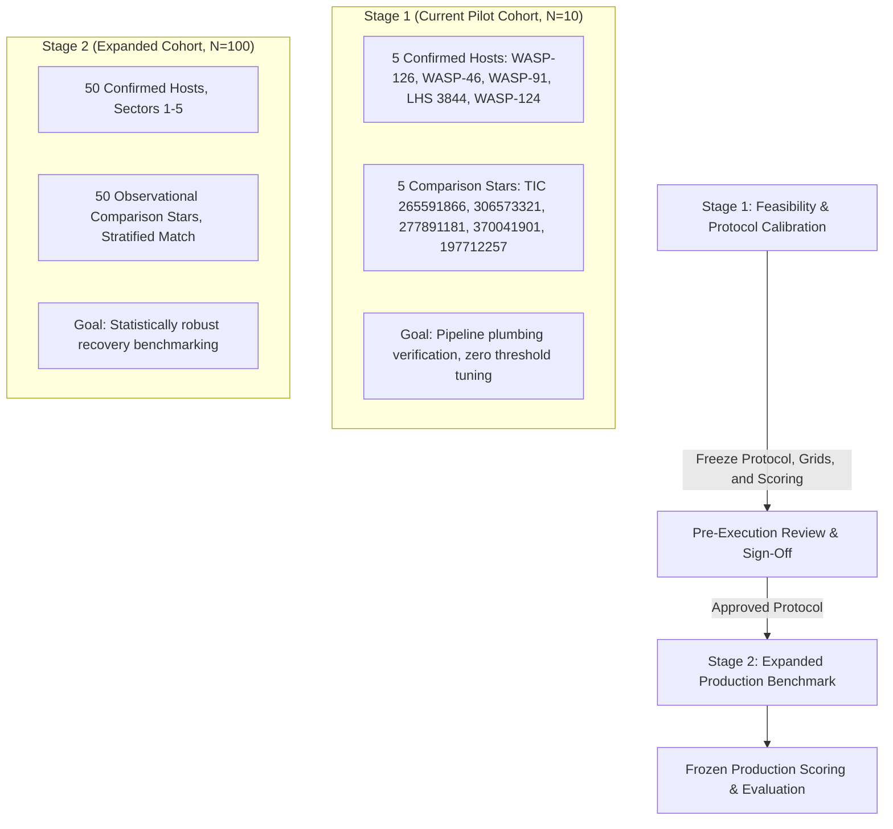

# Benchmark Protocol: Blind Known-Transit Recovery on Genuine TESS Observations

**Project**: TESS Transit Detection Benchmark  
**Document ID**: `docs/real_data_benchmark_protocol.md`  
**Version**: 1.3.2 (Methodological Consistency & Reproducibility Audit)  
**Date**: 2026-09-28  
**Author**: Computational Astrophysics Research Group  
**Status**: **FROZEN PROPOSAL — AWAITING RESEARCHER APPROVAL BEFORE EXECUTION**  

> [!IMPORTANT]
> **Scientific Integrity & Scope Invariant**:
> This document specifies the experimental protocol for evaluating blind transit detection methods on authentic TESS space telescope photometry.
> **This protocol is a specification only. No detection experiments, model evaluations, target cohort expansions, or additional data downloads are executed within this document.**
> Ingestion and quality assurance verification from the Sector 1 pilot validate photometric data integrity, **not** algorithm detection performance. A documented safeguard is a protocol design requirement, not empirical proof that future code enforces it.

---

## Revision History

| Version | Date | Author | Summary of Changes |
| :--- | :---: | :--- | :--- |
| **v1.0** | 2026-09-28 | Research Group | Initial draft protocol defining primary question, staged cohort design, BLS baseline, ephemeris air-gap, and scoring. |
| **v1.1** | 2026-09-28 | Research Group | Methodological revision addressing comparison-star terminology, CNN dual validation gate, BLS parameters, decoupled scoring, and detrending window lower bound. |
| **v1.2** | 2026-09-28 | Research Group | Refinement of BLS frequency spacing physics, circular phase epoch alignment, event coverage formulation, detrending segment-wise rules, and ML candidate-vetting task definition. |
| **v1.3** | 2026-09-28 | Research Group | Rigorous mathematical audit & correction: transit-depth variance $\operatorname{Var}(\delta) = (\sum_{\text{in}} w_i)^{-1} + (\sum_{\text{out}} w_j)^{-1}$, WLS regression covariance matrix, SDE vs SNR decoupling, general ephemeris variance, BLS grid dimensional terms, five-tier event coverage, detrending attenuation risk, ML candidate-vetting role. |
| **v1.3.1** | 2026-09-28 | Research Group | Consistency audit: formal segregation of target eligibility from epoch matching, continuous temporal coverage fraction via Lebesgue measure, sector boundary exclusion, ephemeris provenance, detrending WLS fit procedure, SDE background options. |
| **v1.3.2** | 2026-09-28 | Research Group | **Methodological Consistency & Reproducibility Audit**: <br>• **Ephemeris Covariance Correction**: Corrected propagation analysis to prove variance error depends on $\operatorname{sgn}(E \cdot \operatorname{Cov}(T_0, P))$; prohibited characterizing zero-covariance as universally conservative or underestimating.<br>• **Epoch Matching & GATE-12 Option C Clarification**: Clarified that $0.25 T_{\text{dur}}$ is an empirical detector resolution term requiring synthetic calibration (or a core-dip scoring convention), while the $0.50 T_{\text{dur}}$ cap is a scoring convention, not a statistical confidence bound.<br>• **Event Coverage & Sector Boundary Policy**: Defined baseline via exposure boundaries $[t_{\text{base},\min}, t_{\text{base},\max}]$; formulated partial exposure intersection measure $\mu(I_i \cap W_{\text{event}, k})$; designated categorical exclusion of partial events as a PROPOSED methodological choice pending approval.<br>• **Detrending Validation Formalization**: Defined local baseline normalization $C_{\text{out}}$; specified Box, Trapezoid, and Limb-Darkened template options under `GATE-05`; defined failure handling ($f_{\text{fail}} = N_{\text{failed}} / N_{\text{total}}$) and mandated separate failure reporting with both omnibus and convergent percentiles.<br>• **Astropy Reproducibility**: Corrected inequality `astropy>=6.0.0` as dependency constraint, not an exact pin; mandated recording `astropy.__version__`, exact arguments, and full frequency grid array at runtime.<br>• **SDE Alias Exclusion Formulation**: Formally defined identification of fundamental peak, harmonics ($2f_0, 3f_0$), subharmonics ($f_0/2, f_0/3$), satellite aliases ($f_0 \pm 0.0730\text{ d}^{-1}$), composite union $\mathcal{E}$, invalid bins, and $<50$ degeneracy rule under `GATE-11`.<br>• **Proposed Defaults vs Pending Gates**: Visibly marked all unresolved numerical candidates as PROPOSED and AWAITING RESEARCHER APPROVAL across all 12 gates.<br>• **Validation Boundaries**: Formally separated YAML syntax checks, existing unit tests, semantic reviews, and empirical validation; affirmed zero empirical validation performed. |

---

## 1. Primary Research Question and Scientific Objectives

### 1.1 Core Research Question
The benchmark investigates the following primary empirical question:

> **"Can automated, blind transit-search methods recover cataloged transiting exoplanets from genuine TESS flight light curves under realistic instrument systematics, spacecraft downlink gaps, and cadence limitations, without injecting prior ephemeris knowledge?"**

### 1.2 Five Distinct Observational and Algorithmic Outcomes
To eliminate ambiguous scientific claims, the benchmark enforces strict operational separation among five categories:

```
+---------------------------------------------------------------------------------------------------------+
|                                    FIVE DISTINCT BENCHMARK OUTCOMES                                     |
+---------------------------------------------------------------------------------------------------------+
| 1. Target-Level Planet Recovery   | Algorithm flags star as a candidate host AND recovers true physical |
|                                   | orbital parameters (period and epoch) within strict tolerances.     |
| 2. Event-Level Transit Recovery   | Algorithm identifies individual physical transit dips in time,      |
|                                   | correctly distinguishing covered events from downlink gaps.         |
| 3. Period Recovery                | Detected period matches fundamental catalog period or an integer    |
|                                   | harmonic/subharmonic within pre-specified numerical tolerance.       |
| 4. Comparison-Star Detection      | Algorithm flags a candidate on an observational comparison star.    |
|    (Catalog-Inconsistent Rate)    | Evaluates detector sensitivity to stellar activity / systematics.   |
| 5. Observational Non-Detection    | Target light curve exhibits no detectable periodic dip.             |
|                                   | For comparison stars: consistent with catalog; NOT proof of no planet|
+---------------------------------------------------------------------------------------------------------+
```

---

## 2. Comparison-Star Interpretation and Cohort Representativeness

### 2.1 Astronomical Reality of Comparison Stars
1. **Terminology Standard**: Detections on comparison stars must **never** be labeled as "confirmed false positives." They shall be reported strictly as the **"comparison-star detection rate"** or **"catalog-inconsistent detection rate."**
2. **Unconfirmed Negative Invariant**: Comparison stars without cataloged exoplanets are **not proven planet-free**. A single 27.4-day TESS sector cannot rule out:
   - Terrestrial or sub-Neptune exoplanets ($R_p \lesssim 1.5\text{ }R_\oplus$) below the photometric noise floor.
   - Long-period exoplanets ($P > 14\text{ days}$) where fewer than two transits occur.
   - Non-transiting planetary systems (orbital inclinations $i \ll 90^\circ$).
3. **Dissecting Comparison-Star Detections**: When an algorithm triggers on a comparison star, the signal must be classified into:
   - *Astrophysical stellar variability* (rotational modulation, starspots, stellar flares).
   - *Instrumental systematics* (momentum dumps, Earthshine, thermal drift, scattered light).
   - *Astrophysical false positives* (background eclipsing binaries blended in the 21-arcsecond TESS pixel).
   - *Uncataloged planetary candidates* (signals warranting independent vetting).

### 2.2 Cohort Balance vs Survey Occurrence Rates
> [!WARNING]
> **Prohibition on Population-Level Inferences from Balanced Cohorts**:
> In the natural sky, transiting hot Jupiters have an occurrence rate of $\sim 0.5\text{--}1\%$, and overall transiting planets have an occurrence of $\sim 1\text{--}5\%$.
> A balanced 50:50 host/comparison cohort is an **artificial benchmark construct** designed to provide equal statistical weight to positive and comparison targets.
> **Under no circumstances shall the balanced cohort metrics (such as precision or false-alarm fractions) be interpreted as representative of natural TESS survey deployment precision, true positive predictive value (PPV), or survey discovery yield.**

- **Descriptive Metrics for Benchmark Cohort**:
  - Sensitivity / Recall on confirmed hosts: $\text{Recall} = \text{TP} / N_{\text{eligible hosts}}$.
  - Comparison-Star Detection Rate: $R_{\text{comp}} = N_{\text{detected controls}} / N_{\text{comparison stars}}$.
- **Inadmissible Inferences**:
  - Survey Precision / PPV: Cannot be computed without weighting by the true astrophysical prior occurrence rate $\pi_0 \approx 0.01$.
  - Population-level False Positive Rate: Cannot be asserted without representative stellar field sampling.

---

## 3. Benchmark Cohort Design and Eligibility Rules

### 3.1 Staged Cohort Execution Architecture
To guarantee reproducibility and avoid iterative data snooping, the benchmark is organized into two sequential stages:



### 3.2 Stage 1 Feasibility Boundary
The existing 10-star Sector 1 pilot cohort is strictly restricted to:
1. Verifying the software air-gap between search and scoring pipelines.
2. Checking JSON and CSV serialization schemas.
3. Confirming deterministic execution and numerical reproducibility across repeated runs.
4. Unit and integration testing of scoring logic.
5. End-to-end software execution plumbing.

> [!CAUTION]
> **Stage 1 Tuning Prohibition**:
> The 10-star pilot **must not** be used to tune detection thresholds, optimize hyperparameters, or assert comparative model performance.
> If a frozen parameter must be modified to fix an implementation defect, a formal protocol version increment (e.g. v1.3 $\to$ v1.4) must be documented in [docs/benchmark_decision_log.md](file:///home/purab/Purab/Projects/TESS-Light-curve/docs/benchmark_decision_log.md) prior to re-execution.

### 3.3 Confirmed Planet Host Eligibility Requirements
A candidate host is eligible for inclusion in the confirmed host cohort if and only if it satisfies all of the following criteria:
1. **Catalog Confirmation & Source-Specific Verification**:
   - Confirmed exoplanet status verified in the NASA Exoplanet Archive (`pscomppars` table with confirmed publication; TOI project table disposition `tfopwg_disp` equal to `'KP'` [Known Planet] or `'CP'` [Confirmed Planet]).
   - **Mid-Transit Definition Audit**: For each target, source-specific literature provenance must verify that the catalog epoch $T_0$ represents the **physical transit midpoint** (time of mid-transit / contact 2/3 midpoint), rather than transit ingress, egress, or orbital periastron passage.
   - **Time Standard & Scale Reconciliation**: Verification that $T_0$ is defined on the Barycentric Dynamical Time scale ($\text{BJD}_{\text{TDB}}$) and converted correctly to Barycentric TESS Julian Date ($\text{BTJD} = \text{BJD}_{\text{TDB}} - 2457000.0$). If an original discovery source reports timing in $\text{HJD}_{\text{UTC}}$ or $\text{BJD}_{\text{UTC}}$, barycentric and clock leap-second corrections ($\approx 69.184\text{ s}$) must be explicitly reconciled and recorded in the target provenance table before ingestion.
2. **Data Product & Cadence**: NASA SPOC 120-second (2-minute) cadence Pre-search Data Conditioning Simple Aperture Photometry (`PDCSAP_FLUX`) stored in standard FITS format.
3. **A Priori Ephemeris Target Eligibility Bound**:
   - Documented orbital period $P$, transit duration $T_{\text{dur}}$, transit depth $\delta$, and their formal uncertainties.
   - Propagated timing uncertainty across the observing sector baseline must satisfy:
     $$\sigma_{t_{\text{mid}}}(E) = \sqrt{\sigma_{T_0}^2 + E^2 \sigma_P^2 + 2 E \operatorname{Cov}(T_0, P)} \le 0.25 \times T_{\text{dur}}$$
     *(Detailed mathematical analysis of the cross-term $2 E \operatorname{Cov}(T_0, P)$ and catalog zero-covariance limitations in Section 6.2.4).*
   - **Crucial Methodological Distinction**: This inequality is strictly a **pre-benchmarking target eligibility filter** that ensures catalog ground-truth ephemerides are sufficiently precise across the observation sector to permit rigorous scoring. Targets failing this criterion are excluded a priori and logged in the target attrition ledger. **This ephemeris eligibility threshold must not be conflated with the detected-epoch matching tolerance $\Delta t_{0,\text{tol}}$** (evaluated in Section 6.2.3 and governed by `GATE-12`), which measures how closely a detector's recovered transit center matches the true midtime.
4. **Period Search Range Compatibility**:
   - Primary benchmark search range is $P \in [0.5, 15.0]\text{ days}$, clamped to $0.95 \times \text{usable observation baseline}$.
   - Hosts with $P > 15.0\text{ days}$ cannot be recovered at their fundamental period within a 15-day search grid; single-transit events are treated as a separate future event-detection track, not as periodic BLS recoveries.
   - *Status*: `GATE-07` (**APPROVED: Option A**, 2026-09-30). Minimum search period is retained at 0.5 days; nominal maximum search period is set to 15.0 days, clamped to $0.95 \times \text{usable observation baseline}$. The primary periodic BLS search is not extended to 25 days. Pilot target note: LHS 3844 b catalog period ($\approx 0.4629\text{ d}$) is below 0.5 d; its pilot detection near $0.92535\text{ d}$ is a $2\times$ harmonic recovery under approved GATE-04 Option B, NOT a fundamental-period recovery. This is a pilot-specific observation and not generalized to other targets.
5. **Multi-Planet Systems**:
   - Single-peak BLS is designed for single periodic signals; in multi-planet systems, mutual transits or secondary planets introduce unmodeled variance.
   - *Status*: `GATE-06` (**APPROVED: Option C, Iterative Multi-Signal Recovery**, 2026-09-30).
     - **Primary Benchmark Cohort**: Restricted strictly to qualified confirmed single-planet hosts.
     - **Cohort Fallback Hierarchy**: First expand the observing sector range (e.g., Sectors 1–10) to seek at least 50 qualified single-planet hosts. If and only if the available single-planet pool remains below 50 after this expanded-sector inventory, multi-planet systems are permitted as a fallback cohort.
     - **Strict Cohort Segregation**: Multi-planet systems must remain separately identified and reported in all tables, figures, and summaries; silent pooling with the primary single-planet cohort is prohibited.
     - **Methodology & Protocol Requirements**: Iterative multi-signal recovery must detect a candidate signal, remove or account for that signal's contribution to the light curve, and repeat the BLS search for additional signals until a predefined stopping condition is reached.
     - **Pending Implementation Parameters**: The exact signal-removal method (in-transit masking vs. model subtraction/pre-whitening), significance thresholds (minimum SDE/SNR per iteration), maximum candidate count per target, and stopping parameters remain explicitly pending a separate future implementation and validation decision. Neither method is selected in this gate.
     - **Matching & Scoring Rules**: Requires strict one-to-one matching between detected candidate signals and eligible catalogued planets (one detected signal cannot count toward multiple planets). Enforces the approved GATE-04 Option B narrow harmonic policy ($\mathcal{H} = \{1/2, 1, 2\}$ within the approved GATE-01 $1.0\%$ relative tolerance), recording fundamental vs. harmonic/alias recovery. Evaluates planet-level recovery rate, false-positive candidate counts, system-level any-planet recovery, and complete-system recovery.
     - **Current Software State**: Existing BLS code (`src/tess_benchmark/baselines/bls.py`) extracts only the single global maximum peak and does not yet implement, test, or validate iterative multi-signal recovery.
     - **Observational Controls**: Comparison stars without detected TOIs/TCEs remain defined as observational non-detection controls, not proven planet-free stars.
6. **Predeclared Recovery Eligibility Rules**:
   - **Eligible for Period Recovery**: Must exhibit $\ge 2$ predicted transit windows with adequate cadence coverage within the observed sector.
   - **Eligible for Event-Level Recovery**: Must exhibit $\ge 1$ predicted transit window with adequate cadence coverage.
   - **Single-Transit Systems**: Evaluated strictly for event-level recovery and excluded from the period recovery evaluation denominator.
7. **No Outcome-Based Selection**: Targets must be selected blindly based on catalog physical properties ($P, T_{\text{dur}}$, depth, magnitude), never filtered or replaced based on whether preliminary detectors succeed.

### 3.4 Observational Comparison Star Requirements
1. **Catalog Verification Provenance**:
   - Queried against NASA Exoplanet Archive `toi` table: 0 matching records.
   - Queried against NASA Exoplanet Archive `tce` (Threshold Crossing Events) table: 0 matching records.
   - Queried against NASA Exoplanet Archive `pscomppars` table: 0 matching records.
   - Query date and API endpoint must be recorded in the target inventory manifest.
2. **Property Stratification**:
   Comparison stars must be matched to the host cohort on:
   - TESS apparent magnitude distribution ($|T_{\text{mag, control}} - T_{\text{mag, host}}| \le 1.0\text{ mag}$).
   - Observing sector and camera/CCD focal plane location.
   - Usable cadence duty cycle ($\ge 80\%$ usable cadences).
   - Baseline length ($\ge 20.0\text{ days}$).

### 3.5 Single-Sector vs Multi-Sector Scope
- Primary benchmark scope is strictly **single-sector light curves** ($T_{\text{baseline}} \approx 27.4\text{ days}$).
- If a star is observed across multiple sectors (e.g. Sector 1 and Sector 2), each sector light curve is treated as an independent observation keyed by `(target_id, sector)`.
- **Grouped Partitioning Invariant**: Any cross-validation or training splits must group by `target_id` via `StarGroupSplitter`, ensuring all sectors of a star reside exclusively in either the training set or the test set ($\mathcal{S}_{\text{train}} \cap \mathcal{S}_{\text{test}} = \emptyset$).
- *Status*: Multi-sector stitched light curves are deferred to exploratory follow-up studies.

---

## 4. Blind Evaluation and Leakage Prevention Architecture

### 4.1 Strict Air-Gap Between Search and Scoring
To prevent data snooping, the software architecture enforces a strict physical separation between the **Search Pipeline** and the **Evaluation/Scoring Layer**:

```
+-------------------------------------------------------------------------------------------------------+
|                                    BLIND EVALUATION ARCHITECTURE                                      |
+-------------------------------------------------------------------------------------------------------+
| INPUT TO SEARCH PIPELINE (Accessible to Algorithms via BlindLightCurve):                              |
|   - Opaque Target ID (e.g. TARGET_001, TARGET_002)                                                    |
|   - Time Vector: t [BTJD]                                                                             |
|   - Normalized Flux Vector: f_norm (label-blind median division)                                     |
|   - Normalized Flux Error Vector: ferr_norm                                                           |
|   - Quality Mask: QUALITY == 0 boolean filter                                                         |
|                                                                                                       |
| STRICTLY FORBIDDEN FROM SEARCH PIPELINE:                                                              |
|   - Catalog Period (P_true)                                                                           |
|   - Catalog Reference Epoch (T0_true)                                                                 |
|   - Catalog Transit Duration (Tdur_true)                                                              |
|   - Catalog Transit Depth (depth_true)                                                                |
|   - Host vs Control Category Label (category)                                                         |
|   - Prior Transit Window Annotations / Masking Vectors                                                |
|   - Stellar Coordinates / Host Identification (TIC ID mapped to opaque ID)                            |
+-------------------------------------------------------------------------------------------------------+
                                            │
                                            ▼
                      FROZEN DETECTOR OUTPUT ARTIFACT (CSV / JSON)
                      - target_id: TARGET_001
                      - is_detected: true/false
                      - detected_period: float (days)
                      - detected_t0: float (BTJD)
                      - detected_duration: float (days)
                      - detected_depth: float (ppm)
                      - detection_score: float (SDE or probability)
                                            │
                                            ▼
+-------------------------------------------------------------------------------------------------------+
| EVALUATION & SCORING LAYER (Runs ONLY after Detector Outputs are Frozen):                             |
|   - Merges Frozen Detector Outputs with Ephemeris Ground-Truth Table                                  |
|   - Evaluates Period Recovery against True Period                                                     |
|   - Evaluates Epoch and Event Overlap against Verified Windows                                        |
|   - Computes Standard Classification and Recovery Metrics                                             |
+-------------------------------------------------------------------------------------------------------+
```

### 4.2 Preprocessing, Detrending, and Transit Preservation Validation
1. **Primary Preprocessing: Label-Blind Normalization (APPROVED: GATE-05 Option 4)**:
   $$F_{\text{norm}}(t_i) = \frac{F_{\text{raw}}(t_i)}{\text{median}(F_{\text{raw}}[\text{valid}])}$$
   - Primary benchmark preprocessing uses native NASA SPOC `PDCSAP_FLUX` with scalar median normalization across all unflagged, finite cadences without masking known transit windows.
   - **No additional filter detrending** is applied in the primary benchmark path. This guarantees zero additional filter-induced transit depth attenuation or duration distortion from this benchmark's detrending stage (without claiming that native SPOC PDCSAP itself has zero total attenuation).
2. **Secondary Sensitivity Track (Segment-Wise Running Median)**:
   - A segment-wise running median filter ($W_{\text{detrend}} = 1.25\text{ days}$, $30.0\text{ hours}$) is evaluated as an independent secondary sensitivity comparison in a segregated diagnostic ledger.
   - Results from this secondary track are strictly isolated and never combined with primary benchmark scores or qualification claims.
   - **Deferred Method**: Option 3 (robust biweight spline detrending, $W=1.25\text{ d}$) is parked as deferred, not rejected. It is not implemented or evaluated at this stage; any future consideration requires a separate researcher decision and validation plan.
3. **Risk of Transit Attenuation & Air-Gap Constraint**:
   - Because catalog ephemerides are strictly air-gapped during blind detection, transit masking is unavailable during search preprocessing.
   - For an unmasked running median with window $W_{\text{detrend}} = 30\text{ hours}$, transits of duration $T_{\text{dur}} \in [6, 8]\text{ hours}$ occupy $20\text{--}27\%$ of the window, creating depth attenuation risk in the presence of noise or gaps. Primary evaluation on native PDCSAP completely bypasses this risk.
   - **Protocol Invariant**: The protocol **does not claim** that unmasked running median detrending preserves transit signals without attenuation until empirical validation has been executed.
4. **Mandatory Synthetic-Injection Detrending Validation Procedure**:
   Before freezing the preprocessing pipeline for production runs, a dedicated detrending validation experiment must be executed on external flight calibration curves:
   - **Signal Injection**: Inject synthetic limb-darkened transit models (Mandel & Agol 2002) with known physical depths $\delta_{\text{inj}} = (R_p / R_*)^2 \in [500, 25000]\text{ ppm}$, durations $T_{\text{dur}} \in [1.0, 8.0]\text{ hours}$, and periods $P \in [0.5, 15.0]\text{ days}$ into quiet observational comparison light curves.
   - **Blind Filtering**: Apply the candidate detrending filter ($W_{\text{detrend}} = 1.25\text{ d}$) to the injected light curves without transit masking.
   - **Local Baseline Normalization & Out-of-Transit Flux Estimation**:
     For each injected transit event $k$ centered at injection midtime $t_{\text{mid}, k}$, evaluate detrended flux within local window $I_{\text{fit}, k} = [t_{\text{mid}, k} - 3 T_{\text{dur}}, \, t_{\text{mid}, k} + 3 T_{\text{dur}}]$.
     Out-of-transit cadences are defined as $\mathcal{O}_k = \{ i \in I_{\text{fit}, k} : |t_i - t_{\text{mid}, k}| > T_{\text{dur}}/2 \}$.
     The local baseline continuum flux level $C_{\text{out}}$ is estimated via weighted mean:
     $$C_{\text{out}} = \frac{\sum_{j \in \mathcal{O}_k} w_j y_j}{\sum_{j \in \mathcal{O}_k} w_j}, \quad w_j = \frac{1}{\sigma_j^2}$$
     Cadence fluxes are normalized locally: $y'_{i} = y_i / C_{\text{out}}$.
   - **Exact Fitting Model Specification (`GATE-05`)**:
     A profile template $\psi(t)$ normalized to unit depth is fitted to the locally normalized flux via weighted least squares to determine recovered depth $\hat{\delta}_{\text{post}}$:
     $$m(t; \delta) = 1.0 - \delta \cdot \psi(t)$$
     Candidate fitting models under `GATE-05` include:
     1. *Option A (Proposed Baseline)*: Inverted Top-Hat (Box) profile:
        $$\psi_{\text{box}}(t) = \mathbf{1}(|t - t_{\text{mid}}| \le T_{\text{dur}}/2)$$
     2. *Option B (Alternative)*: Symmetric Trapezoidal profile with fixed ingress/egress fraction $\tau = 0.10 T_{\text{dur}}$:
        $$\psi_{\text{trap}}(t) = \begin{cases} 1 & |t - t_{\text{mid}}| \le T_{\text{dur}}/2 - \tau \\ \frac{T_{\text{dur}}/2 - |t - t_{\text{mid}}|}{\tau} & T_{\text{dur}}/2 - \tau < |t - t_{\text{mid}}| \le T_{\text{dur}}/2 \\ 0 & \text{otherwise} \end{cases}$$
     3. *Option C (Analytic Template)*: Mandel & Agol (2002) limb-darkened profile parameterized by injection $(u_1, u_2)$.
     *(The choice of recovered-depth fitting template is PROPOSED and remains AWAITING RESEARCHER APPROVAL under `GATE-05`).*
   - **Preservation Metrics**:
     $$R_{\text{depth}} = \frac{\hat{\delta}_{\text{post}}}{\delta_{\text{inj}}}, \quad R_{\text{SNR}} = \frac{\text{SNR}_{\text{post}}}{\text{SNR}_{\text{pre}}}$$
   - **Handling of Failed, Non-Finite, and Edge-Affected Fits**:
     - *Failure Criteria*: A recovery fit is classified as `failed` if:
       a) Local window contains $< 3$ valid in-transit points ($N_{\text{in}} < 3$) or $< 5$ out-of-transit points ($|\mathcal{O}_k| < 5$),
       b) The weighted least-squares normal equation is singular or numerically ill-conditioned,
       c) The fitted depth $\hat{\delta}_{\text{post}}$ is non-finite (NaN or Inf), or
       d) The fitted depth is non-physical or inverted ($\hat{\delta}_{\text{post}} \le 0$).
     - *Mandatory Failure Rate Diagnostic*: Failed recoveries must **never** be silently dropped or omitted from acceptance reporting. The validation pipeline must report the explicit failure rate:
       $$f_{\text{fail}} = \frac{N_{\text{failed}}}{N_{\text{total}}}$$
     - *Dual Reporting Standard*: Summary statistics for depth preservation $R_{\text{depth}}$ must be published for two distinct populations:
       1. **Omnibus Population ($N_{\text{total}}$)**: Assigns $R_{\text{depth}} = 0$ to all failed fits, ensuring filter-induced signal destruction directly penalizes overall performance.
       2. **Convergent Population ($N_{\text{convergent}} = N_{\text{total}} - N_{\text{failed}}$)**: Reports percentiles strictly over successfully converged fits, explicitly coupled with $f_{\text{fail}}$.
     - *Edge Segregation*: Injections falling within $W_{\text{detrend}} / 2$ ($0.625\text{ d}$) of segment boundaries or telemetry gaps are tagged `edge_affected: bool` and analyzed in a separate diagnostic subgroup ($N_{\text{edge}}$ vs $N_{\text{core}}$).
   - **Required Distribution & Subgroup Reporting**:
     Validation reporting must present full empirical distributions (percentiles $p_{10}, p_{50}, p_{90}$, standard deviations, CDFs) and subgroup breakdowns across:
     - Depth bins: shallow ($[500, 2000]\text{ ppm}$), intermediate ($[2000, 8000]\text{ ppm}$), deep ($[8000, 25000]\text{ ppm}$).
     - Duration bins: short ($[1.0, 3.0]\text{ h}$), medium ($[3.0, 5.0]\text{ h}$), long ($[5.0, 8.0]\text{ h}$).
     - Period bins: short ($[0.5, 3.0]\text{ d}$), medium ($[3.0, 10.0]\text{ d}$), long ($[10.0, 15.0]\text{ d}$).
     - Proximity to edges: interior ($|t - t_{\text{edge}}| > W/2$) vs boundary-adjacent ($|t - t_{\text{edge}}| \le W/2$).
   - **Acceptance Threshold Status & Failure Rate Discrepancy**:
     Candidate thresholds for detrending filter qualification: Median $R_{\text{depth}} \ge 0.95$ for $T_{\text{dur}} \le 6.0\text{ hours}$ and $R_{\text{depth}} \ge 0.90$ for $T_{\text{dur}} \in [6.0, 8.0]\text{ hours}$.
     *Failure Rate Discrepancy*: The maximum acceptable failure rate threshold is inconsistent across documents ($f_{\text{fail}} \le 0.02$ [2.0%] here vs $f_{\text{fail}} \le 0.01$ [1.0%] in `configs/real_benchmark_protocol.yaml` line 47). This discrepancy is recorded as **unresolved** under approved GATE-05 Option 4 and explicitly requires a separate researcher decision before any detrending filter could be qualified or promoted to the primary pipeline.
5. **Segment-Wise Processing and Gap Handling**:
   - Detrending filters must **never** smooth or interpolate across telemetry gaps $> 6.0\text{ hours}$.
   - Detrending must be executed independently per continuous observation segment.
   - **Minimum Segment Length**: A segment must span $\ge W_{\text{detrend}}$ ($1.25\text{ days}$). Segments shorter than $W_{\text{detrend}}$ are detrended by subtracting their scalar median and tagged with `short_segment: bool`.
   - **Edge Handling & Tagging**: Cadences within $W_{\text{detrend}} / 2$ of a segment boundary lack a symmetric filter window. Boundary reflection does not guarantee unbiased behavior near segment edges; all cadences within $W_{\text{detrend}} / 2$ of an edge must be tagged with `edge_affected: bool` in the derived product.
6. **Outlier Flagging and Data Immutability**:
   - Outliers are identified using a running median filter ($W_{\text{outlier}} = 0.5\text{ days}$) and normalized MAD:
     $$\sigma_{\text{MAD}} = 1.4826 \times \operatorname{median}(|y - y_{\text{med}}|)$$
   - **Asymmetric Flagging**: Positive outliers ($y - y_{\text{med}} > +5 \sigma_{\text{MAD}}$, representing stellar flares or cosmic rays) are flagged. Negative outliers ($y < y_{\text{med}}$) are **never** clipped or altered, ensuring transit ingress/egress is strictly preserved.
   - **Immutability Standard**: Original raw flux values are never silently replaced. Flagged points are retained in memory with a boolean `outlier_flag` mask and documented in an audit artifact (`outlier_reconciliation.csv`).

---

## 5. Search Methods and Baseline Suite

The benchmark distinguishes two fundamentally different computational tasks:
- **Task A: Blind Transit Search / Detection**: Algorithms that scan a light curve, search period-duration space, and independently estimate $(P, t_0, T_{\text{dur}}, \delta)$.
- **Task B: Candidate Vetting**: Classifiers that receive a pre-generated candidate (e.g. from BLS) and classify or rank it.

```
+--------------------------------------------------------------------------------------------------------+
|                                  BENCHMARK METHOD EVALUATION SUITE                                     |
+--------------------------------------------------------------------------------------------------------+
| Method / Algorithm  | Benchmark Role   | Input Representation | Required Training Data | Status         |
+---------------------+------------------+----------------------+------------------------+----------------+
| 1. Astropy BLS      | Primary Search   | Cleaned Time Series  | None (Unsupervised)    | PRIMARY        |
| 2. Random Forest    | Candidate Vetting| 22-dim Tabular Feats | External / Synthetic   | VETTING TRACK  |
| 3. HistGradBoost    | Candidate Vetting| 22-dim Tabular Feats | External / Synthetic   | VETTING TRACK  |
| 4. 1D CNN           | Candidate Vetting| Phase-Folded Profile | External / Synthetic   | ON PROBATION   |
+--------------------------------------------------------------------------------------------------------+
```

### 5.1 Classical Baseline: Astropy Box Least Squares (BLS) Reproducibility Specification

#### 5.1.1 Physics of Frequency Spacing, Duration Dependency, and Baseline Scaling
In astronomical transit searches (Kovacs et al. 2002), a trial frequency error $\delta f$ causes a cumulative transit phase shift across the observed usable baseline $T_{\text{usable}} = t_{\max} - t_{\min}$:
$$\delta \phi = T_{\text{usable}} \cdot \delta f$$
To prevent a transit of duration $T_{\text{dur}}$ from smearing out of phase, the phase shift must not exceed a fraction of the transit duty cycle $q = T_{\text{dur}} / P$. This establishes the duration-dependent frequency spacing requirement:
$$\Delta f(P) \le \frac{q}{f_{\text{factor}} \cdot T_{\text{usable}}} = \frac{\min(T_{\text{dur}})}{P \cdot f_{\text{factor}} \cdot T_{\text{usable}}}$$
- **Impact of Trial-Duration Range**:
  Because the duty cycle $q = T_{\text{dur}} / P$ decreases linearly with decreasing transit duration, the **minimum trial duration** $\min(T_{\text{dur}})$ ($1.0\text{ hour} = 0.0417\text{ days}$) dictates the strictest upper bound on frequency step size $\Delta f(P)$ across the entire search grid. Longer trial durations tolerate coarser steps, but to recover narrow transits without phase smearing, the entire grid must satisfy the resolution required by $\min(T_{\text{dur}})$.
- **Dimensional Terms & Definitions**:
  - $T_{\text{usable}}$: Actual usable baseline span ($t_{\max} - t_{\min}$) in days [T], distinct from nominal sector duration ($27.4\text{ d}$).
  - $P$: Trial orbital period in days [T] ($P \in [P_{\min}, P_{\max}]$, e.g. $[0.5, 15.0]\text{ days}$).
  - $T_{\text{dur}}$: Trial transit duration in days [T] ($T_{\text{dur}} \in [0.0417, 0.3333]\text{ days}$, 1.0 to 8.0 hours).
  - $q = T_{\text{dur}} / P$: Fractional transit duration / duty cycle [dimensionless].
  - $f_{\text{factor}}$: Oversampling factor [dimensionless, positive float, e.g. 5.0].
  - $\Delta f(P)$: Frequency spacing in $\text{days}^{-1}$ [$\text{T}^{-1}$].
  - $N_{\text{transits, min}} = 2$: Minimum observed transits required for period search eligibility.
- **Resolution Hazard**: A single global step $\Delta f = 1 / (f_{\text{factor}} \cdot T_{\text{baseline}})$ with $f_{\text{factor}} = 5.0$ yields only $\approx 266$ points across $[0.0667, 2.0]\text{ d}^{-1}$. For a short-period planet ($P = 1\text{ d}$, $T_{\text{dur}} = 1.5\text{ h}$), neighboring trial periods differ by $\approx 10.6\text{ minutes}$, producing an accumulated phase shift of $\approx 4.8\text{ hours}$ across 27 days—completely smearing out the transit dip.
- **Astropy Implementation & Exact API Specification**:
  Standard Astropy `BoxLeastSquares.autoperiod()` dynamically constructs frequency steps satisfying the duration bound. The benchmark implementation must call:
  ```python
  from astropy.timeseries import BoxLeastSquares

  model = BoxLeastSquares(t_valid, f_valid, dy=ferr_valid)
  durations = np.linspace(1.0 / 24.0, 8.0 / 24.0, 8)  # 1.0h to 8.0h in 1.0h increments
  periods = model.autoperiod(
      duration=durations,
      minimum_period=0.5,
      maximum_period=15.0,
      frequency_factor=5.0,
      minimum_n_transit=2,
  )
  ```
- **Astropy Versioning & Implementation Recording Requirements**:
  The environment specification requires `astropy>=6.0.0` as a minimum dependency constraint, but this inequality is **not an exact version pin**. Across Astropy minor releases, default behaviors in `BoxLeastSquares.autoperiod()` keyword validation, numerical precision, and duration caching may vary. To ensure complete scientific reproducibility:
  1. The **exact installed version** (obtained from `astropy.__version__`, e.g. `8.0.1` in the current verification environment) must be captured and frozen in an environment lockfile (`poetry.lock` or `requirements.lock`).
  2. The exact API arguments passed to `autoperiod()` must be recorded in the execution run metadata.
  3. The exact generated frequency/period grid array (or its cryptographic SHA-256 hash, length, and bounding values) must be serialized to an artifact during benchmark execution to verify bitwise grid identity.
  Implementation must record these parameters rather than relying on unpinned library resolution.
- **Calibration Isolation**:
  The oversampling factor $f_{\text{factor}}$ (proposed candidate: 5.0) directly governs periodogram grid density ($10,000\text{--}50,000$ points) and execution runtime. Tuning $f_{\text{factor}}$ on benchmark targets constitutes subtle data snooping. Calibration must be performed **strictly on external synthetic injection light curves** with known periods and durations, evaluating recovery completeness versus runtime. Tuning on real benchmark labels is strictly prohibited.
- **Decision Gate [APPROVED 2026-09-30]**: Governed by `GATE-09`. Option A (Astropy `autoperiod()` with $f_{\text{factor}}=5.0$) is approved as the **primary benchmark grid** based on 5/5 pilot recovery with low compute latency ($\approx 0.50\text{ s}$/target). Option B (explicit uniform frequency grid with $N_{\text{freq}} \ge 25,000, \Delta f \le 0.00008\text{ d}^{-1}$) is approved as a **controlled sensitivity comparison grid**. Pilot results are preserved and qualified as preliminary feasibility checks, not general proofs of superiority.

#### 5.1.2 Duration Grid, Model Formulation, and Background Distribution
1. **Duration Grid Construction**:
   Linearly spaced grid of trial durations:
   $$T_{\text{dur}} \in [0.0417, 0.0833, 0.1250, 0.1667, 0.2083, 0.2500, 0.2917, 0.3333]\text{ days}$$
   spanning $1.0\text{ hour}$ to $8.0\text{ hours}$ in $1.0\text{ hour}$ increments.
2. **Transit Model, Weighted Means Difference, and Least-Squares Regression Formulation**:
   - **Simple Difference of Independent Weighted Means**:
     Let the normalized flux at cadence $i$ be $y_i$ with diagonal weights $w_i = 1 / \sigma_i^2$, where $\sigma_i = \text{PDCSAP\_FLUX\_ERR}_i / \text{median}(F)$ represents normalized photometric measurement error.
     The weighted in-transit mean $\bar{y}_{\text{in}}$ and out-of-transit mean $\bar{y}_{\text{out}}$ are:
     $$\bar{y}_{\text{in}} = \frac{\sum_{i \in \text{in}} w_i y_i}{\sum_{i \in \text{in}} w_i}, \quad \bar{y}_{\text{out}} = \frac{\sum_{j \in \text{out}} w_j y_j}{\sum_{j \in \text{out}} w_j}$$
     Assuming independent, uncorrelated errors $\epsilon_i \sim \mathcal{N}(0, \sigma_i^2)$ (ignoring correlated red noise, which represents an idealized white-noise lower bound):
     $$\operatorname{Var}(\bar{y}_{\text{in}}) = \frac{\sum_{i \in \text{in}} w_i^2 \operatorname{Var}(y_i)}{\left(\sum_{i \in \text{in}} w_i\right)^2} = \frac{1}{\sum_{i \in \text{in}} w_i}, \quad \operatorname{Var}(\bar{y}_{\text{out}}) = \frac{1}{\sum_{j \in \text{out}} w_j}$$
     The physical transit depth is $\delta = \bar{y}_{\text{out}} - \bar{y}_{\text{in}}$, with exact variance:
     $$\operatorname{Var}(\delta) = \operatorname{Var}(\bar{y}_{\text{out}} - \bar{y}_{\text{in}}) = \operatorname{Var}(\bar{y}_{\text{out}}) + \operatorname{Var}(\bar{y}_{\text{in}}) = \frac{1}{\sum_{i \in \text{in}} w_i} + \frac{1}{\sum_{j \in \text{out}} w_j}$$
     The formal standard error of the transit depth is strictly the square root:
     $$\sigma_\delta = \sqrt{\operatorname{Var}(\delta)} = \sqrt{\frac{1}{\sum_{i \in \text{in}} w_i} + \frac{1}{\sum_{j \in \text{out}} w_j}}$$
     *(The square root must never be omitted).*
     The physical Signal-to-Noise Ratio (SNR) is:
     $$\text{SNR} = \frac{\delta}{\sigma_\delta} = \frac{\delta}{\sqrt{\operatorname{Var}(\delta)}}$$

   - **Equivalent Weighted Least-Squares (WLS) Regression Formulation**:
     Equivalently, the BLS transit model can be formulated as a linear regression:
     $$y_i = \beta_0 + \beta_1 x_i + \epsilon_i$$
     where $x_i = 1$ if cadence $i$ falls in-transit and $x_i = 0$ out-of-transit. Here, the out-of-transit baseline is $L = \beta_0$, transit depth is $\delta = -\beta_1$, and $\mathbf{\epsilon} \sim \mathcal{N}(\mathbf{0}, \mathbf{W}^{-1})$ with diagonal weight matrix $W_{ii} = w_i = 1 / \sigma_i^2$.
     The design matrix is $\mathbf{X} = [\mathbf{1}, \mathbf{x}]$, yielding:
     $$\mathbf{X}^T \mathbf{W} \mathbf{X} = \begin{pmatrix} \sum_{\text{all}} w_i & \sum_{\text{in}} w_i \\ \sum_{\text{in}} w_i & \sum_{\text{in}} w_i \end{pmatrix}$$
     with determinant $D = (\sum_{\text{all}} w_i)(\sum_{\text{in}} w_i) - (\sum_{\text{in}} w_i)^2 = (\sum_{\text{out}} w_j)(\sum_{\text{in}} w_i)$.
     The coefficient covariance matrix is given by:
     $$\operatorname{Cov}(\mathbf{\beta}) = (\mathbf{X}^T \mathbf{W} \mathbf{X})^{-1} = \frac{1}{(\sum_{\text{out}} w_j)(\sum_{\text{in}} w_i)} \begin{pmatrix} \sum_{\text{in}} w_i & -\sum_{\text{in}} w_i \\ -\sum_{\text{in}} w_i & \sum_{\text{all}} w_i \end{pmatrix}$$
     The variance of the transit depth $\delta = -\beta_1$ is the lower-right diagonal element:
     $$\operatorname{Var}(\delta) = \operatorname{Var}(\beta_1) = \frac{\sum_{\text{all}} w_i}{(\sum_{\text{out}} w_j)(\sum_{\text{in}} w_i)} = \frac{\sum_{\text{in}} w_i + \sum_{\text{out}} w_j}{(\sum_{\text{out}} w_j)(\sum_{\text{in}} w_i)} = \frac{1}{\sum_{i \in \text{in}} w_i} + \frac{1}{\sum_{j \in \text{out}} w_j}$$
     which yields the identical standard error $\sigma_\delta = \sqrt{\operatorname{Var}(\delta)}$ and $\text{SNR} = \delta / \sigma_\delta$.
     - *BLS Flux Weighting Status (`GATE-10`)*: **APPROVED: Option A (Inverse-Variance Weighting)**, 2026-09-30. The primary BLS baseline uses inverse-variance weighting ($w_i = 1/\sigma_i^2$) computed from normalized SPOC flux errors and passed via `dy` to Astropy BoxLeastSquares. Uniform weighting ($w_i = 1$) is retained as an approved future secondary sensitivity analysis in a separate diagnostic ledger.

3. **Formal Decoupling of Physical SNR and Spectral SDE**:
   - **Signal-to-Noise Ratio (SNR)**: Evaluates the physical significance of the observed transit dip relative to photometric noise ($\text{SNR} = \delta / \sigma_\delta$).
   - **Signal Detection Efficiency (SDE)**: Evaluates the prominence of a periodogram peak relative to the spectral noise floor of trial frequencies:
     $$\text{SDE} = \frac{P_{\text{max}} - \mu_{\text{Power}}}{\sigma_{\text{Power}}}$$
   - **Non-Equivalence & Distinction**: SDE is a spectral statistic dependent on periodogram peak prominence, frequency resolution, and periodogram variance across the searched frequency band. SNR is a time-domain photometric statistic dependent on transit depth, cadence count, and photometric error bars. They quantify fundamentally different properties of the signal and must **never** be treated as interchangeable.

4. **SDE Background Distribution Specification**:
   Let the BLS periodogram power across searched trial frequencies $f_m$ be $\mathcal{P} = \{P_m = \text{Power}(f_m)\}_{m=1}^M$.
   - **Global Maximum Peak**: $P_{\text{max}} = \max_m P_m$ at trial frequency $f_0 = f_{\text{peak}}$.
   - **Invalid Frequency Bins**: Any frequency bin where $P_m$ is non-finite (NaN, Inf), uncalculated, or non-positive ($P_m \le 0$) is masked into $\mathcal{I}_{\text{invalid}}$ prior to statistical evaluation. If fewer than 50 valid frequency bins remain ($|\mathcal{P}_{\text{valid}}| < 50$), SDE cannot be reliably computed; the detector must return $\text{SDE} = \text{NaN}$ with an explicit boolean flag `sde_degenerate = True`.
   - **Peak, Harmonic, and Alias Identification**:
     When peak and harmonic exclusion is applied:
     1. *Fundamental Peak Exclusion*: $E_0 = [f_0 - \Delta f_{\text{excl}}, \, f_0 + \Delta f_{\text{excl}}]$, where the exclusion half-width is standardized to $\Delta f_{\text{excl}} = 3 \Delta f$ (3 frequency-grid spacings), resolving INC-02 and harmonizing protocol text with YAML configuration and Decision Log.
     2. *Orbital Harmonics*: Frequencies at integer multiples $f_{\text{harm}, j} = j \cdot f_0$ for $j \in \{2, 3\}$.
     3. *Orbital Subharmonics*: Frequencies at integer submultiples $f_{\text{sub}, j} = f_0 / j$ for $j \in \{2, 3\}$.
     4. *Spacecraft Orbital Aliases*: Frequencies offset by the TESS orbital frequency: $f_{\text{alias}, \pm} = f_0 \pm f_{\text{orbit}}$, where $f_{\text{orbit}} = 1 / (13.7\text{ days}) \approx 0.0730\text{ d}^{-1}$.
     5. *Exclusion Interval for Harmonics/Aliases*: For each harmonic or alias frequency $f_h$ falling within $[f_{\min}, f_{\max}]$, an exclusion interval is defined: $E_h = [f_h - \Delta f_{\text{excl}}, \, f_h + \Delta f_{\text{excl}}]$.
   - **Overlapping Exclusion Regions**:
     Because trial frequencies are discrete and harmonics can lie close together, exclusion intervals $E_0, E_h$ frequently overlap. The composite exclusion mask is defined strictly as the **union of intervals**:
     $$\mathcal{E} = E_0 \cup \left( \bigcup_{h} E_h \right)$$
     All frequency bins falling within $\mathcal{E}$ are masked out simultaneously. Taking the formal union guarantees that overlapping regions do not double-count exclusions or cause array indexing errors.
   - **Background Power Population**:
     $$\mathcal{P}_{\text{bg}} = \{ P_m \in \mathcal{P} : f_m \notin \mathcal{E} \quad \text{and} \quad m \notin \mathcal{I}_{\text{invalid}} \}$$
   - **Preserved Decision Gate Options and Approval Status (`GATE-11`)**:
     The mathematical formulation of periodogram background statistics $(\mu_{\text{bg}}, \sigma_{\text{bg}})$ is governed by `GATE-11` (**APPROVED**, 2026-09-30):
     - *Option A (All Frequencies Unclipped) [APPROVED STAGE 1 BASELINE]*: Parametric mean and standard deviation computed over all valid frequencies $\mathcal{P}_{\text{valid}}$, including the peak and harmonics. Approved as the baseline for Stage 1 feasibility execution (matching existing code in `src/tess_benchmark/baselines/bls.py`).
     - *Option B (Peak-Excluded Robust MAD)*: Mask strictly $E_0$; compute $\mu_{\text{robust}} = \operatorname{median}(\mathcal{P}_{\text{valid}} \setminus E_0)$ and $\sigma_{\text{robust}} = 1.4826 \times \operatorname{MAD}(\mathcal{P}_{\text{valid}} \setminus E_0)$.
     - *Option C (Peak-, Harmonic-, and Alias-Excluded Robust MAD) [APPROVED STAGE 2 CANDIDATE]*: Mask the full union $\mathcal{E}$; compute robust median and Normalized MAD over $\mathcal{P}_{\text{bg}}$. Recorded as the intended Stage 2 production candidate, strictly conditional on the designated Experiment 2 comparison. Option C is NOT described as empirically selected, validated, or adopted as the final production method before Experiment 2 is completed and reviewed.
     - *Option D (Iterative $3\sigma$-Clipped Parametric)*: Iteratively reject bins $> 3\sigma$ from the mean until convergence.
     *(Experiment 2 planned comparison remains unchanged and has not yet been executed).*
5. **Deterministic Tie-Breaking**:
   If multiple frequency points yield identical objective power within $10^{-8}$, the lower orbital period (higher frequency) is deterministically selected.
6. **Isolated Timing Protocol**:
   Wall-clock search runtime is measured using `time.perf_counter()` strictly isolating `BLSDetector.search()`, excluding FITS loading, preprocessing, and disk I/O.

### 5.2 Supervised Tabular ML: Candidate Vetting Role and Boundary
> [!IMPORTANT]
> **Strict Methodological Distinction: Search vs Vetting**:
> Random Forest and HistGradientBoosting operate on the 22-dimensional feature space derived from the light curve and BLS periodogram (`bls_sde`, `bls_snr`, `bls_period`, `bls_depth`, `odd_even_depth_ratio`, etc.).
> **They are NOT independent transit search algorithms.** They are **BLS-Candidate Vetting Classifiers** that evaluate whether the primary periodic candidate generated by BLS represents a genuine planetary transit versus an astrophysical or instrumental false alarm.
> They inherit candidate period, epoch, and duration directly from the blind BLS run.

- **Prohibition on Direct Search Comparisons**: Tabular ML vetting results must never be compared directly against BLS search results as if both performed the same task. BLS search performance and ML candidate-vetting performance must be reported in separate, distinct tables.
- **Feature Provenance & Leakage Controls**:
  - Features are extracted blind to catalog labels.
  - Models must be trained strictly on external or synthetic light curves with zero overlap with the benchmark test cohort.
  - Grouping by star (`StarGroupSplitter`) strictly enforces that all observations of any star stay exclusively in either the training or test partition.
- **Threshold Calibration**: The probability decision threshold $p_{\text{thresh}}$ must be calibrated on an independent validation set, never on the real-TESS benchmark test targets.

### 5.3 1D Convolutional Neural Network (CNN) — Deferred Qualification on Conditional Probation (GATE-02 Option C)
- **Historical Defect**: In the synthetic benchmark repair, `TransitCNN1DNet` suffered complete all-positive collapse (TP=4, FP=6, TN=0, FN=0; Specificity = 0.0, FPR = 1.0) on imbalanced test data due to uncalibrated logits and sample starvation ($N_{\text{train}}=30$).
- **Approved Protocol Policy (GATE-02 Option C, Approved 2026-09-30)**:
  Under formal researcher decision `GATE-02` (Option C), formal numerical pass/fail admission thresholds (such as candidate $\text{Specificity} \ge 0.85$ or $\text{Sensitivity} \ge 0.75$) are **deferred** for Stage 1:
  1. **Disabled in Stage 1 Benchmark**: The 1D CNN baseline remains disabled (`enabled: false`) and on conditional probation. Primary benchmark scoring is restricted to Classical BLS and 22-D Tabular ML baselines.
  2. **Diagnostic & Descriptive Only**: If the CNN is evaluated in secondary exploratory runs, all threshold-dependent metrics and ROC/PR curves must be reported descriptively, without treating them as formal benchmark qualification or claiming transit validation competence.
  3. **Reconsideration Standard**: Formal numerical admission gates will only be reconsidered when an adequately sized, disjoint independent validation cohort (e.g. $N \ge 100$, with $\ge 50$ hosts and $\ge 50$ controls) is assembled, featuring proper probability calibration and out-of-sample threshold tuning.
  4. **Safeguards Preserved**: Any diagnostic evaluation must continue to enforce blind phase-folding (folded strictly by blind BLS period, never catalog ephemeris) and zero test-star leakage.

---

## 6. Scoring Metrics and Operational Definitions

All scoring logic is implemented in the evaluation layer and executed strictly after detector outputs are frozen.

### 6.1 Operational Classification Matrix
For each target in the cohort, the scoring layer assigns exactly one of the following mutually exclusive outcomes:

```
+-------------------------------------------------------------------------------------------------------------------+
|                                            OPERATIONAL SCORING MATRIX                                             |
+-------------------------------------------------------------------------------------------------------------------+
| Operational Outcome                     | Target Class  | Detector Verdict | Ephemeris Matching Condition         |
+-----------------------------------------+---------------+------------------+--------------------------------------+
| 1. Full Orbit Recovery (TP_full)        | Confirmed Host| is_detected=True | Period Match (Fund) AND Epoch Match  |
| 2. Period Match, Epoch Mismatch (TP_pe) | Confirmed Host| is_detected=True | Period Match (Fund) BUT Epoch Differ |
| 3. Harmonic Recovery (TP_harm)          | Confirmed Host| is_detected=True | Harmonic Match (r in H \ {1})        |
| 4. Unmatched Detection (FP_host_alias)  | Confirmed Host| is_detected=True | Neither Period nor Harmonic Match    |
| 5. Target Miss (FN)                     | Confirmed Host| is_detected=False| N/A (Algorithmic Non-Detection)      |
| 6. Comparison Detection (FP_comp)       | Comparison    | is_detected=True | N/A (Catalog-Inconsistent Signal)    |
| 7. Comparison Non-Detection (TN_comp)   | Comparison    | is_detected=False| N/A (Catalog-Consistent Null)        |
+-------------------------------------------------------------------------------------------------------------------+
```

### 6.2 Mathematical Matching Formulations

#### 6.2.1 Fundamental Period Matching
$$\frac{|P_{\text{det}} - P_{\text{true}}|}{P_{\text{true}}} \le \epsilon_P$$
Standard relative tolerance is $\epsilon_P = 0.01$ ($1.0\%$).
*(Status: `GATE-01` APPROVED [Option A: Fixed 1.0% relative tolerance $\epsilon_P = 0.01$; period-dependent/grid-dependent $\Delta f \cdot P^2$ and Fourier-derived formulas rejected]).*

#### 6.2.2 Harmonic Period Matching
Let ratio $r = P_{\text{det}} / P_{\text{true}}$. The detection is a harmonic recovery if:
$$\min_{h \in \mathcal{H}} \frac{|r - h|}{h} \le \epsilon_P, \quad \text{where } \mathcal{H} = \left\{\frac{1}{2}, 2\right\}$$
*(Status: `GATE-04` APPROVED [Option B: Narrow harmonic set $\mathcal{H} = \{1/2, 2\}$; accepted period ratios $\{1/2, 1, 2\}$. Ratios $1/3$ and $3$ are rejected for formal recovery scoring. Paired exploratory comparison on the 5 Sector 1 pilot hosts showed parity (5/5 under both options) and did not distinguish them; Option B was selected as the formal operational definition to prevent spurious alias inflation]).*
**Harmonic recoveries must be reported separately and never silently counted as fundamental period recoveries.**

#### 6.2.3 Circular Phase Distance Epoch Alignment
Epoch alignment is assessed **only conditional on period matching** (fundamental or harmonic). The catalog reference epoch $T_{0,\text{true}}$ is propagated to the nearest physical transit midtime $t_{\text{mid}, k} = T_{0,\text{true}} + E_k \cdot P_{\text{true}}$ falling within the target's observation baseline $[t_{\min}, t_{\max}]$.

To ensure circular mathematical correctness across all phase angles, the circular phase distance between detected epoch $t_{0,\text{det}}$ and true transit midtime $t_{\text{mid}, k}$ is computed as:
$$\Delta \phi = \left| \left( \left( \frac{t_{0,\text{det}} - t_{\text{mid}, k}}{P_{\text{true}}} + 0.5 \right) \pmod 1 \right) - 0.5 \right|$$
Physical time offset is:
$$\Delta t_0 = \Delta \phi \cdot P_{\text{true}}$$
An epoch match is declared satisfied if:
$$\Delta t_0 \le \Delta t_{0,\text{tol}}$$
where the exact mathematical definition of $\Delta t_{0,\text{tol}}$ is governed by `GATE-12` (**APPROVED: Option C Bounded Composite Convention**, 2026-09-30):
- **Option A (Physical Transit Dip Overlap)**: $\Delta t_{0,\text{tol}} = 0.50 \times T_{\text{dur}}$ (requires detected center to fall within physical 1st-to-4th contact window $[-T_{\text{dur}}/2, +T_{\text{dur}}/2]$).
- **Option B (Transit Core / Flat-Bottom Overlap)**: $\Delta t_{0,\text{tol}} = 0.25 \times T_{\text{dur}}$ (stricter alignment within central transit core).
- **Option C [APPROVED] (Bounded Composite Formulation)**:
  $$\Delta t_{0,\text{tol}} = \min\left(0.50 \times T_{\text{dur}}, \quad \sqrt{(0.25 \times T_{\text{dur}})^2 + (3 \times \sigma_{t_{\text{mid}}})^2}\right)$$
  - *Normative Meaning of Terms*:
    1. **$0.25 \times T_{\text{dur}}$ Term**: Adopted as the **normative central-core alignment convention**.
    2. **$0.50 \times T_{\text{dur}}$ Cap**: The clamping bound $\min(0.50 \times T_{\text{dur}}, \dots)$ is strictly a **normative scoring convention** enforcing that no detection whose estimated midpoint lies outside the physical 1st-to-4th contact dip ($|t - t_{\text{mid}}| > 0.50 T_{\text{dur}}$) can be rewarded as a True Positive. It is **NOT a statistical confidence bound**.
    Both terms are explicitly defined as **protocol conventions**, NOT empirically calibrated tolerances. Requires strict one-to-one candidate-to-catalog-planet matching and GATE-04 harmonic bookkeeping. Epoch matching scoring implementation in code is currently pending in `RealDataBenchmarkScorer`.

#### 6.2.4 General Ephemeris Variance Formulation and Covariance Limitations
The general variance of a predicted transit midtime at integer epoch offset $E_k$ from reference epoch $T_0$ is:
$$\operatorname{Var}(t_{\text{mid}}(E_k)) = \sigma_{T_0}^2 + E_k^2 \sigma_P^2 + 2 E_k \operatorname{Cov}(T_0, P)$$
$$\sigma_{t_{\text{mid}}}(E_k) = \sqrt{\operatorname{Var}(t_{\text{mid}}(E_k))}$$
- **Catalog Covariance Limitation**: Public exoplanet archive tables (NASA Exoplanet Archive `pscomppars`, `toi`) publish marginal 1D uncertainties $\sigma_{T_0}$ and $\sigma_P$ but do not provide the off-diagonal covariance term $\operatorname{Cov}(T_0, P)$. The independence approximation $\operatorname{Cov}(T_0, P) \approx 0$ is therefore adopted out of operational necessity.
- **Mathematical Impact of Omitting Covariance**: In joint transit fits, $T_0$ and $P$ are correlated. The sign of the cross-term $2 E_k \operatorname{Cov}(T_0, P)$ depends strictly on the sign of the product $E_k \cdot \operatorname{Cov}(T_0, P)$:
  - If $E_k \cdot \operatorname{Cov}(T_0, P) > 0$, the true variance is greater than the zero-covariance approximation, so omitting covariance **underestimates** timing uncertainty.
  - If $E_k \cdot \operatorname{Cov}(T_0, P) < 0$, the true variance is smaller than the zero-covariance approximation, so omitting covariance **overestimates** timing uncertainty.
  - If $E_k = 0$, the covariance term vanishes identically.
  Because the epoch offset $E_k = (t_{\text{mid}, k} - T_0) / P$ can be either positive ($t_{\text{mid}} > T_0$) or negative ($t_{\text{mid}} < T_0$, e.g. when $T_0$ is defined from later follow-up or extended mission sectors), and the sign of $\operatorname{Cov}(T_0, P)$ is unknown without the discovery fit covariance matrix:
- **Integrity Rule**: The zero-covariance approximation is an unverified catalog data limitation. **It must NOT be characterized as universally conservative or universally underestimating uncertainty.** Target eligibility requires $\sigma_{t_{\text{mid}}} \le 0.25 T_{\text{dur}}$ to guard against gross ephemeris degradation.

### 6.3 Metric Formulas and Explicit Denominators

```
+--------------------------------------------------------------------------------------------------------------+
|                                        EXPLICIT METRIC DENOMINATORS                                          |
+--------------------------------------------------------------------------------------------------------------+
| Metric Name                         | Formula                                        | Denominator Meaning   |
+-------------------------------------+------------------------------------------------+-----------------------+
| Fundamental Period Recovery Rate    | f_fund = N(TP_full + TP_pe) / N_eligible_hosts  | Eligible Hosts        |
| Harmonic Period Recovery Rate       | f_harm = N(TP_harm) / N_eligible_hosts         | Eligible Hosts        |
| Total Period Recovery Rate          | f_total = f_fund + f_harm                      | Eligible Hosts        |
| Full Orbit Recovery Rate            | f_orbit = N(TP_full) / N_eligible_hosts        | Eligible Hosts        |
| Epoch Recovery Rate (Conditional)   | f_epoch = N(TP_full) / N(TP_fund)              | Fundamental Matches   |
| Comparison-Star Detection Rate      | R_comp = N(FP_comp) / N_comp_stars             | Comparison Stars      |
| Target-Level Benchmark Precision    | TP_full / (TP_full + FP_host_alias + FP_comp)  | All Benchmark Detections|
| Target-Level Benchmark Recall       | (TP_full + TP_pe) / N_eligible_hosts           | Eligible Hosts        |
+--------------------------------------------------------------------------------------------------------------+
```

### 6.4 Statistical Uncertainty Reporting
1. **Binomial Proportions**:
   For all sample recovery fractions $p = k / n$, 95% confidence intervals must be computed using the **Wilson score interval**:
   $$\text{CI}_{95\%} = \frac{p + \frac{z^2}{2n} \pm z \sqrt{\frac{p(1-p)}{n} + \frac{z^2}{4n^2}}}{1 + \frac{z^2}{n}}, \quad z = 1.96$$
2. **Small-Sample Limitations in Stage 1 ($N=10$)**:
   With $N=5$ hosts, a recovery of $4/5$ yields an empirical rate of $80\%$, but the 95% Wilson interval spans $[37.6\%, 96.4\%]$.
   **Wilson score intervals quantify sampling variance only; they do not compensate for small cohort size, lack of population representativeness, or catalog label uncertainty.**

---

## 7. Data Quality, Usable Cadence, and Event Coverage Rules

### 7.1 Cadence Cleaning Hierarchy
1. Retain strictly `QUALITY == 0` cadences.
2. Confirm finite `TIME`, `PDCSAP_FLUX`, and `PDCSAP_FLUX_ERR`.
3. Enforce strict timestamp monotonicity ($t_{i+1} > t_i$) with zero duplicate timestamps.

### 7.2 Event-Level Coverage and Cadence Formulations
For each transit event $k$ with catalog midtime $t_{\text{mid}, k}$ and transit duration $T_{\text{dur}}$:

#### 7.2.1 Transit Duration vs Event Evaluation Window
A clear distinction is maintained between:
- **Physical Transit Duration** ($T_{\text{dur}}$): The first-to-fourth contact time ($t_4 - t_1$) of the planetary transit dip.
- **Event Evaluation Window** ($W_{\text{event}, k}$): The closed time interval over which in-transit cadences are evaluated:
  $$W_{\text{event}, k} = \left[t_{\text{mid}, k} - \frac{T_{\text{dur}}}{2}, \quad t_{\text{mid}, k} + \frac{T_{\text{dur}}}{2}\right]$$
  *(If an optional baseline margin $M$ is defined, $W_{\text{window}} = [t_{\text{mid}} - T_{\text{dur}}/2 - M, t_{\text{mid}} + T_{\text{dur}}/2 + M]$; $T_{\text{dur}}$ and $W_{\text{event}}$ remain separate).*

#### 7.2.2 Five-Tier Event Classification Hierarchy
Across all predicted transit events, the protocol defines five mutually exclusive, nested categories:
1. **Predicted Events** ($N_{\text{predicted}}$): Total geometric midtimes within the mission ephemeris timeline.
2. **Baseline-Intersecting Events** ($N_{\text{baseline}}$): Events whose window $W_{\text{event}, k}$ intersects the observation baseline $[t_{\min}, t_{\max}]$.
3. **Downloaded-Cadence Events** ($N_{\text{downloaded}}$): Events containing $\ge 1$ raw cadences in the FITS table.
4. **Quality-Valid Events** ($N_{\text{valid}}$): Events containing $\ge 1$ cadences satisfying $\text{QUALITY} = 0$, finite `TIME`, and finite `PDCSAP_FLUX`.
5. **Adequately Covered Events** ($N_{\text{adequate}}$): Events meeting the predeclared adequacy criterion ($N_{\text{valid}} \ge 5$ and $f_{\text{coverage}} \ge 50\%$).

#### 7.2.3 Temporal Coverage Fraction, Baseline Boundaries, and Cadence Diagnostics
- **Observation Baseline Definition**:
  To evaluate whether an event falls within the observation window, the benchmark formally defines the observation baseline using **exposure boundaries**:
  $$t_{\text{base},\min} = \min_{i \in \text{valid}}\left(t_i - \frac{\Delta t_{\text{exp}}}{2}\right), \quad t_{\text{base},\max} = \max_{i \in \text{valid}}\left(t_i + \frac{\Delta t_{\text{exp}}}{2}\right)$$
  *(This is physically consistent with continuous integration intervals, contrasting with the narrower cadence-centers baseline $[t_{\text{center},\min}, t_{\text{center},\max}] = [\min(t_i), \max(t_i)]$).*
- **Exposure Interval Representation & Boundary Overlap**:
  Each valid cadence $i$ represents an integration interval $I_i = [t_{i,\text{start}}, t_{i,\text{end}}] = [t_i - \Delta t_{\text{exp}}/2, t_i + \Delta t_{\text{exp}}/2]$, where for SPOC 120-second cadence $\Delta t_{\text{exp}} = 120.0\text{ seconds} = 2.0\text{ minutes} = 0.001388889\text{ days}$.
  Let the union of valid exposure intervals be $\mathcal{I}_{\text{valid}} = \bigcup_{i \in \text{valid}} I_i$.
  Any exposure interval that partially intersects the physical transit window $W_{\text{event}, k} = [t_{\text{start}, k}, t_{\text{end}, k}] = [t_{\text{mid}, k} - T_{\text{dur}}/2, t_{\text{mid}, k} + T_{\text{dur}}/2]$ contributes the exact 1D Lebesgue measure ($\mu$) of its intersection:
  $$\mu(I_i \cap W_{\text{event}, k}) = \max\left(0, \quad \min(t_{i,\text{end}}, t_{\text{end}, k}) - \max(t_{i,\text{start}}, t_{\text{start}, k})\right)$$
  If an exposure straddles the ingress or egress boundary, only the sub-interval falling strictly within $W_{\text{event}, k}$ contributes to the covered duration.
- **Continuous Temporal Coverage**:
  Accounting for exposure intervals overlapping window boundaries, data gaps, or irregular cadence spacing, the total covered duration within event window $W_{\text{event}, k}$ is:
  $$\Delta T_{\text{covered}, k} = \mu\left( W_{\text{event}, k} \cap \mathcal{I}_{\text{valid}} \right) = \sum_{i \in \text{valid}} \mu(I_i \cap W_{\text{event}, k})$$
  *(assuming disjoint cadences; in general, the union measure $\mu(\dots)$ handles any potential overlapping exposure intervals without double-counting).*
- **Bounded Temporal Coverage Fraction**:
  The true temporal coverage fraction is normalized strictly by the event window duration $T_{\text{dur}}$:
  $$f_{\text{temporal}, k} = \frac{\Delta T_{\text{covered}, k}}{T_{\text{dur}}}$$
  Because $(W_{\text{event}, k} \cap \mathcal{I}_{\text{valid}}) \subseteq W_{\text{event}, k}$, the covered duration cannot exceed $T_{\text{dur}}$, mathematically guaranteeing:
  $$0 \le f_{\text{temporal}, k} \le 1.0$$
- **Separate Cadence Count Diagnostic**:
  The number of valid cadences falling inside the window is a discrete diagnostic:
  $$N_{\text{valid}, k} = \sum_{i \in \text{valid}} \mathbf{1}(t_i \in W_{\text{event}, k})$$
- **Cadence Count Ratio**:
  $$R_{\text{cadence}, k} = \frac{N_{\text{valid}, k}}{N_{\text{expected}, k}} = \frac{N_{\text{valid}, k}}{\lceil T_{\text{dur}} / \Delta t_{\text{nominal}} \rceil}$$
  *(Only $R_{\text{cadence}, k}$ may exceed 1.0 due to timing jitter or boundary overlap; $f_{\text{temporal}, k}$ is the continuous temporal fraction strictly bounded in $[0, 1]$).*
- **Dual Adequacy Rule (APPROVED: GATE-03 Option 2)**:
  An event is adequately observed for primary benchmark scoring if and only if BOTH criteria are simultaneously met on a fully interior transit window:
  $$f_{\text{temporal}, k} \ge 0.50 \quad \text{AND} \quad N_{\text{valid}, k} \ge 5$$
  **Prohibition on Cadence-Only Adequacy**: A minimum cadence count alone (e.g. $N_{\text{valid}} \ge 5$) does **not** qualify as adequate coverage. For example, 5 cadences clustered in a 10-minute segment of an 8-hour transit spans only $2\%$ temporal coverage, missing $98\%$ of the physical dip. Both temporal span and point count are mandatory.

#### 7.2.4 Sector-Boundary Truncation and Denominator Policy
For event $k$ with window $[t_{\text{start}, k}, t_{\text{end}, k}] = [t_{\text{mid}, k} - T_{\text{dur}}/2, t_{\text{mid}, k} + T_{\text{dur}}/2]$ evaluated against exposure baseline $[t_{\text{base},\min}, t_{\text{base},\max}]$:
1. **Fully Interior Event**: $t_{\text{start}, k} \ge t_{\text{base},\min}$ AND $t_{\text{end}, k} \le t_{\text{base},\max}$.
2. **Sector-Boundary Truncated Event (Partial Event)**:
   - Ingress-truncated: $t_{\text{start}, k} < t_{\text{base},\min} \le t_{\text{end}, k}$.
   - Egress-truncated: $t_{\text{start}, k} \le t_{\text{base},\max} < t_{\text{end}, k}$.
   - Wholly out-of-baseline: $t_{\text{end}, k} < t_{\text{base},\min}$ OR $t_{\text{start}, k} > t_{\text{base},\max}$.
3. **Approved Boundary Event Policy (`GATE-03` Option 2: Dual Adequacy with Segregated Secondary Diagnostic Track)**:
   - *Primary Metric Exclusivity*: Only fully interior events ($W_{\text{event}, k} \subset [t_{\text{base},\min}, t_{\text{base},\max}]$) satisfying $f_{\text{temporal}} \ge 0.50$ AND $N_{\text{valid}} \ge 5$ enter the primary event-recovery denominator ($N_{\text{adequate, interior}}$) and numerator ($N_{\text{recovered, interior}}$). Sector-boundary truncated events are strictly excluded from the primary metric to prevent asymmetric partial dips from distorting detection baselines.
   - *Segregated Secondary Diagnostic Track*: Boundary-truncated events ($W_{\text{event}, k} \not\subset [t_{\text{base},\min}, t_{\text{base},\max}]$) meeting $f_{\text{temporal}} \ge 0.30$ AND $N_{\text{valid}} \ge 3$ are retained and reported separately as a secondary diagnostic:
     $$\text{Recovery}_{\text{boundary, diag}} = \frac{N_{\text{boundary\_recovered}}}{N_{\text{boundary\_adequate}}}$$
     These are explicitly labeled as exploratory diagnostics to assess edge-detection sensitivity without compromising the integrity of primary benchmark scores.
   - *Implementation Caveat*: The continuous exposure overlap measure $\mu(I_i \cap W_{\text{event}, k})$ is the formal standard; the discrete cadence approximation in `tess_loader.py` is documented as a temporary software limitation to be replaced by full Lebesgue interval integration in future code updates.
4. **Denominator Isolation Under Approved Policy**:
   Under approved Option 2:
   - "Sector-Boundary Truncated" events are excluded from the primary event-recovery denominator. Qualifying boundary events ($f_{\text{temporal}} \ge 0.30, N_{\text{valid}} \ge 3$) form the separate denominator $N_{\text{boundary\_adequate}}$ for secondary diagnostic reporting.
   - "Not Observed / Zero Cadence" (downlink gap) events are excluded from both primary and secondary denominators.
   - "Insufficient Coverage" events ($N_{\text{valid}} < 5$ or $f_{\text{temporal}} < 50\%$ for interior events; $N_{\text{valid}} < 3$ or $f_{\text{temporal}} < 30\%$ for boundary events) are excluded from the respective recovery denominators.
   - The primary event-recovery denominator consists strictly of **Adequately Covered Interior Events** ($N_{\text{adequate, interior}}$).

### 7.3 Disambiguation of the 6-Hour Gap Rule
1. **Primary Adequacy Criterion**: Actual in-transit valid temporal coverage ($N_{\text{valid}} \ge 5$ and $f_{\text{temporal}} \ge 50\%$) is the primary determinant of event eligibility.
2. **Local Baseline Interval**: The local interval used to inspect telemetry gaps is:
   $$I_{\text{local}, k} = \left[t_{\text{mid}, k} - T_{\text{dur}}, \quad t_{\text{mid}, k} + T_{\text{dur}}\right]$$
3. **Gap Attribute, Not Automatic Disqualification**:
   If a continuous telemetry gap $> 6.0\text{ hours}$ overlaps $I_{\text{local}, k}$ but the in-transit window $W_{\text{event}, k}$ satisfies $N_{\text{valid}} \ge 5$ and $f_{\text{temporal}} \ge 50\%$, the event is **eligible** for event recovery, and tagged with an event attribute `gap_affected = True`.
   An event is disqualified as "Not Observed / Downlink Lost" only if the gap directly prevents the in-transit window from achieving adequate coverage.

---

## 8. Target and Event Attrition Accounting Standard

To prevent cherry-picking or silent cohort modifications, every benchmark run must publish a formal **Target and Event Attrition Table**:

```
+----------------------------------------------------------------------------------------------------------+
|                                      BENCHMARK ATTRITION LEDGER                                          |
+----------------------------------------------------------------------------------------------------------+
| Candidate Targets Queried                                                     : N_candidate              |
|   - Excluded for Insufficient Sector Baseline (< 20 days)                     : - N_baseline_fail        |
|   - Excluded for Low Usable Cadence Duty Cycle (< 80%)                        : - N_cadence_fail         |
|   - Excluded for Ephemeris Uncertainty Propagation Failure (> 0.25 Tdur)      : - N_ephem_fail           |
|   - Excluded for Period Search Grid Incompatibility (P > 15 days)             : - N_grid_incompat        |
|   - Excluded from Primary Cohort for Multi-Planet Architecture (GATE-06 Option C) : - N_multiplanet          |
| FINAL ELIGIBLE AND SEARCHED TARGET COHORT                                     : N_searched               |
|   ├── Evaluated Confirmed Hosts                                               : N_hosts_eval             |
|   └── Evaluated Comparison Stars                                              : N_comp_eval              |
+----------------------------------------------------------------------------------------------------------+
| Total Predicted Transit Events Across Evaluated Hosts                         : N_events_predicted       |
|   - Excluded as "Not Observed / Zero Cadence" (Fell in Downlink Gap)          : - N_events_zero          |
|   - Excluded as "Sector-Boundary Truncation" (Partial Window Overlap)          : - N_events_boundary      |
|   - Excluded as "Insufficient Coverage" (< 5 cadences or < 50% temporal cov)  : - N_events_insufficient  |
| FINAL ADEQUATELY COVERED TRANSIT EVENTS (Event-Recovery Denominator)          : N_events_adequate        |
+----------------------------------------------------------------------------------------------------------+
```

---

## 9. Future Injection-and-Recovery Study (Distinct Follow-Up Phase)

> [!NOTE]
> The injection-and-recovery study is a **separate follow-up milestone (Phase 3)** and is **NOT** part of the primary known-transit benchmark protocol. It is outlined here to guarantee future architectural compatibility without contaminating the current evaluation.

### 9.1 Scientific Objective of Injections
While the known-transit benchmark measures recovery of actual physical planets, an injection-and-recovery experiment measures the **empirical completeness function** $\eta(R_p, P, T_{\text{mag}})$ across arbitrary parameter grids under genuine space telescope noise.

### 9.2 Mandatory Injection Controls
1. **Host Isolation**: Injections must be performed into **observational comparison stars**, never into confirmed planet hosts, to avoid blending artificial signals with real transit dips.
2. **Physical Transit Modeling**: Must use analytic limb-darkened transit models (e.g. `batman` or Mandel & Agol 2002) with quadratic limb-darkening coefficients interpolated from stellar atmosphere grids based on host $T_{\text{eff}}, \log g, [\text{Fe/H}]$.
3. **Finite Exposure Integration**: To replicate the 120-second TESS integration, model light curves must be supersampled (sub-exposure integration $\ge 5\times$) and numerically integrated across each cadence bin.
4. **Distribution of Injection Parameters**:
   - $P \in [0.5, 15.0]\text{ days}$ (log-uniform).
   - $R_p \in [0.8, 15.0]\text{ }R_\oplus$ (uniform in radius).
   - Impact parameter $b \in [0, 0.9]$ (uniform).
5. **No Ephemeris Leakage**: The recovery algorithms must run blindly on injected curves without knowledge of injected $P, T_0, R_p$.

---

## 10. Summary of Formal Decision Gates Requiring Researcher Approval

The following items are formal decision gates requiring explicit researcher sign-off before executing Stage 1 or Stage 2 benchmark runs:

| Gate ID | Topic | Proposed Option | Alternative Options | Status |
| :--- | :--- | :--- | :--- | :---: |
| **GATE-01** | Period Matching Tolerance | Relative tolerance $\epsilon_P = 1.0\%$ ($0.01$) [Option A] | Fourier limit: $3 \times P^2 / T_{\text{usable}}$ | **APPROVED** |
| **GATE-02** | CNN Dual Validation Gate | Defer formal qualification; retain conditional probation (`enabled: false`) [Option C] | Specificity $\ge 0.85$ / Sensitivity $\ge 0.75$ [Option A]; 0.90 / 0.80 [Option B] | **APPROVED** |
| **GATE-03** | Window Adequacy & Boundary Policy | Target $\Delta T \ge 20\text{ d}$, usable $\ge 80\%$; Primary event $N_{\text{valid}} \ge 5$ AND $f_{\text{temporal}} \ge 50\%$ (interior only); Segregated secondary boundary track ($N_{\text{valid}} \ge 3, f_{\text{temporal}} \ge 30\%$) [Option 2] | Option 1: Categorical exclusion; Option 3: Permissive pooling; Option 4: Duration-scaled | **APPROVED** |
| **GATE-04** | Harmonic Set Definition | Narrow harmonic set: $\mathcal{H} = \{1/2, 2\}$ [Option B] | Broad resonance set: $\mathcal{H} = \{1/3, 1/2, 2, 3\}$ [Option A] | **APPROVED** |
| **GATE-05** | Detrending Filter & Threshold | Primary: Native SPOC PDCSAP (scalar median normalization only); Secondary: Segment-wise running median ($W=1.25\text{ d}$) diagnostic track; Spline deferred; 1% vs 2% $f_{\text{fail}}$ discrepancy unresolved [Option 4] | Option 1: Native only; Option 2: Running median only; Option 3: Spline (deferred) | **APPROVED** |
| **GATE-06** | Multi-Planet Handling | Iterative multi-signal recovery [Option C]; primary single-planet cohort; sector expansion fallback; segregated multi-planet reporting | Option A: Strict single-planet only; Option B: Dominant-planet scoring | **APPROVED** |
| **GATE-07** | Search Range Boundaries | [APPROVED] Restrict cohort to $P \in [0.5, 15.0]\text{ days}$ (clamped to $0.95 \times T_{\text{usable}}$); single-transit events to future track; LHS 3844 b pilot detection ($P \approx 0.925\text{ d}$) documented as $2\times$ harmonic recovery under GATE-04 | Expand BLS grid to $P_{\max} = 25.0\text{ days}$ | **APPROVED** |
| **GATE-08** | Production Cohort Size | [APPROVED] Target $N = 100$ (50 Confirmed Hosts, 50 Observational Comparison Stars; Sectors 1–5; Stage 1 runs on $N=10$ pilot first; comparison stars are non-detection controls) | 30 Hosts, 30 Comparison Stars ($N=60$) | **APPROVED** |
| **GATE-09** | BLS Frequency Grid Spacing | Astropy `autoperiod` adaptive scaling ($f_{\text{factor}}=5.0$) [Option A, Primary] | Fixed uniform frequency grid ($N_{\text{freq}} \ge 25,000, \Delta f \le 0.00008\text{ d}^{-1}$) [Option B, Comparison; corrected from erroneous $\Delta f \approx 0.00730\text{ d}^{-1}$] | **APPROVED** |
| **GATE-10** | BLS Flux Weighting Model | [APPROVED] Inverse-variance weighting ($w_i = 1 / \sigma_i^2$, passed via dy to Astropy BLS; uniform weighting retained as secondary sensitivity) | Uniform weighting ($w_i = 1$) | **APPROVED** |
| **GATE-11** | SDE Background Estimation | [APPROVED] Option A (all-finite parametric mean/std) for Stage 1 baseline; Option C (alias union mask $\mathcal{E}$ + robust MAD) intended Stage 2 candidate conditional on Experiment 2; standardized to $3\Delta f$ peak-exclusion half-width | Option B: Peak-excluded; Option D: Iterative outlier clipping | **APPROVED** |
| **GATE-12** | Epoch Matching Tolerance | [APPROVED] Option C: Bounded composite convention $\Delta t_{0,\text{tol}} = \min(0.50 T_{\text{dur}}, \sqrt{(0.25 T_{\text{dur}})^2 + (3\sigma_{t_{\text{mid}}})^2})$ ($0.25 T_{\text{dur}}$ core convention, $0.50 T_{\text{dur}}$ scoring cap; protocol conventions, not empirically calibrated; scoring pending) | Option A: $0.50 \times T_{\text{dur}}$; Option B: $0.25 \times T_{\text{dur}}$ | **APPROVED** |

